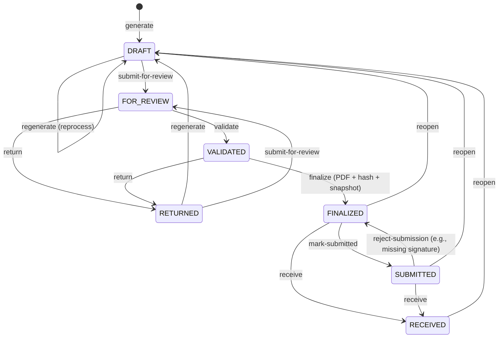
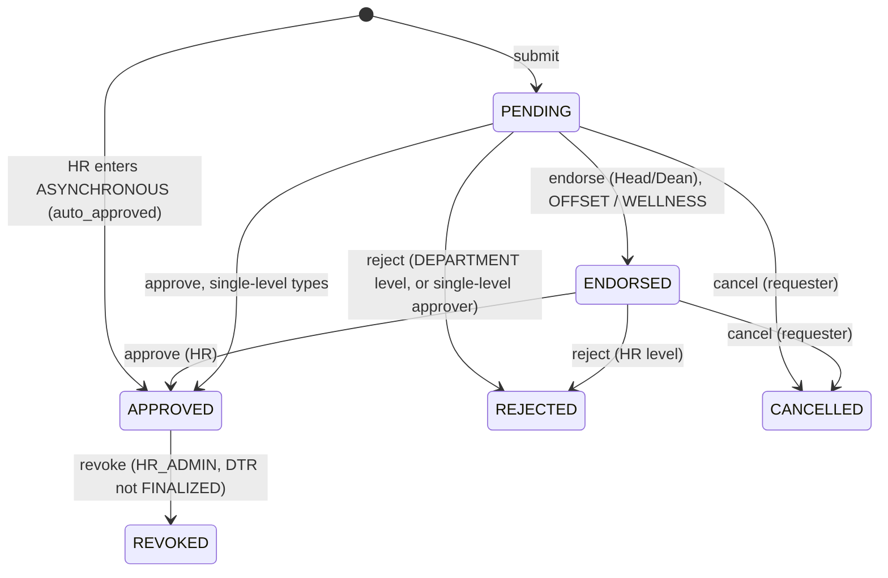
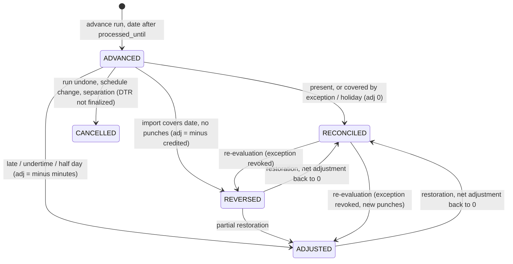
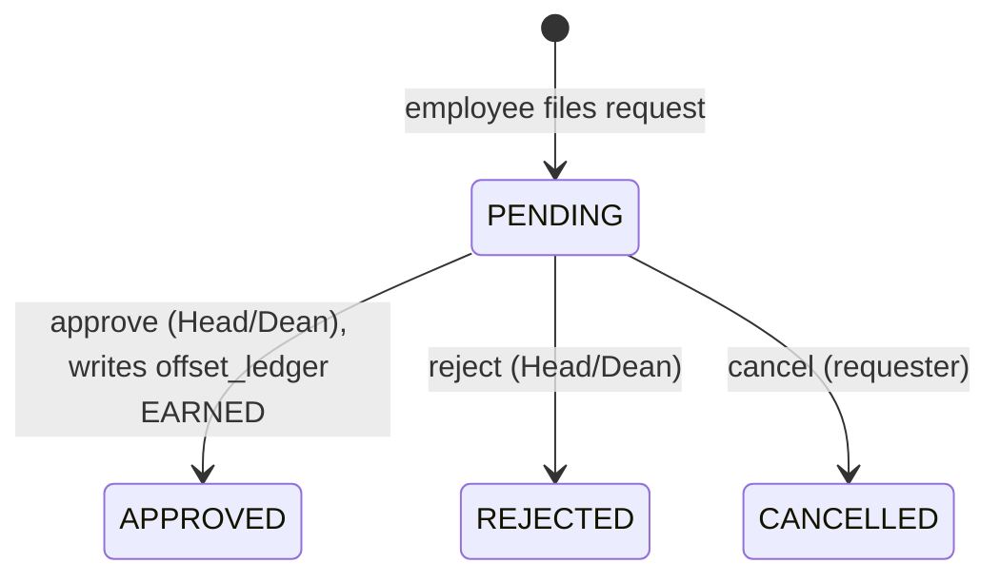
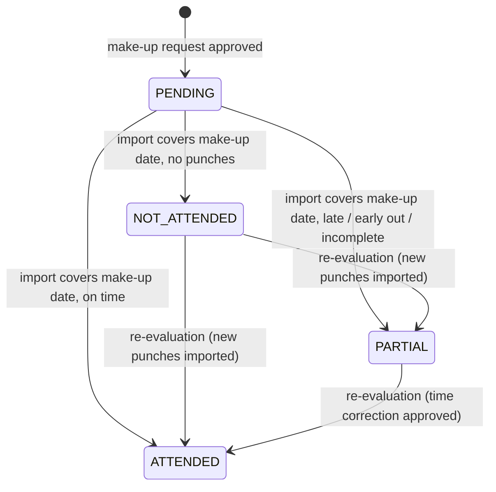

# CVSU DTR — Business Rules

Related: [[CVSU-DTR/v3/README|README]] · [[CVSU-DTR/v3/REQUIREMENTS|REQUIREMENTS]] · [[CVSU-DTR/v3/DATABASE-MAPPING|DATABASE-MAPPING]] · [[CVSU-DTR/v3/DESIGN-PATTERNS|DESIGN-PATTERNS]] · [[CVSU-DTR/HR-Requirements-Analysis|HR-Requirements-Analysis]]

> [!info] What changed in v3
> Source: HR's answers of 2026-10-05, analysed in [[CVSU-DTR/HR-Requirements-Analysis|HR-Requirements-Analysis]] (decisions D-HR-01 … D-HR-25).
> - **ADR-21**: DTR periods are **semi-monthly**, one Form 48 per period (§3, §7, §9).
> - **ADR-22**: **advance processing** (`processing_type = ADVANCE`, `processed_until`) (§3, §12).
> - **ADR-23**: advance credits, make-up outcomes and the offset ledger are **persisted ledgers**. This amends the determinism principle (§2).
> - **ADR-24**: **automatic reconciliation** on import commit, for dates inside the batch's detected range and on the employee's devices (§12.4).
> - **ADR-25**: **carry-forward adjustments** to the next open DTR, all stored in one ledger, `carry_forward_adjustments` (§12.6).
> - **ADR-26**: **attendance basis** and slot sources (§4.5).
> - **ADR-27**: new reasons `ASYNCHRONOUS`, `OFFSET`, `WELLNESS`, `MAKE_UP_CLASS` and the calendar event `GOVERNMENT_ANNOUNCEMENT` (§5.6, §8).
> - **ADR-28**: **two-level approval** for exceptions and schedules (§6, §8.2).
> - **ADR-29**: **offset balance** (§8.3). **ADR-30**: **wellness limit** (§8.4). **ADR-31**: **make-up class** rules (§8.5).
> - **ADR-32**: tardiness is measured from the AM/PM **group start**, for all employees (§4.2).
> - New lifecycles (§9), test cases F/A/R/M (§10), answered and new open questions (§11), and the new **§12 Advance processing and reconciliation**.

> [!warning] Status
> This document fixes the **structure** of the rules and gives **proposed defaults**. Every parameter marked ⚠ is an open question for HR (§11; still-open HR items are in the analysis §8.7). Build the calculators against the parameters, not against hard-coded numbers.

---

## 1. Scope

This document owns:
- how raw punches become a processed day (§3–§5)
- how schedules, exceptions, attendance reasons and the calendar affect the result (§5–§8)
- advance processing, reconciliation and carry-forward adjustments (§12)
- every lifecycle / state machine in the system (§7, §9)
- the reference test cases (§10)

Tables and columns are owned by [[CVSU-DTR/v3/DATABASE-MAPPING|DATABASE-MAPPING]]. This document names them but doesn't define them.

---

## 2. Determinism principle

A processed day is a **pure function** of its inputs:

```
processed_day(employee, date) = f(
    raw punches of the employee's mapped biometric IDs on that local date,
    APPROVED schedule effective on that date,
    APPROVED exceptions for (employee, date)  (incl. approved make-up blocks),
    calendar events for that date and the employee's department,
    rule set version effective on that date,
    employee category / employment type,
    persisted ledger entries for (employee, date):            -- v3, ADR-23
        advance_credits (+ advance_credit_events),
        makeup_class_details outcomes
)
```

Consequences:
- Processed attendance can be **deleted and rebuilt** at any time for any DTR that is not FINALIZED or later.
- Running processing twice gives identical output (idempotent).
- The rule set version and an input fingerprint are stored with each processed day for traceability.

> [!important] v3 amendment (ADR-23, amends ADR-04)
> Some facts are **decisions made at a point in time**, not functions of the inputs. Example: "we credited Sept 14 in full before any data existed". They live in **persisted ledgers**:
> - `advance_credits` and the append-only `advance_credit_events` (§12)
> - the outcomes in `makeup_class_details` (§8.5)
> - `offset_ledger` (§8.3)
> - `carry_forward_adjustments`, the single ledger of every carry-forward deduction and restoration (ADR-25, §12.6)
>
> Rules:
> - Reprocessing **never deletes or rewrites** a ledger. It **reads** ledgers as inputs, just like approved exceptions.
> - A ledger changes only through its own lifecycle: an advance run, a reconciliation, an approval, a semester-end expiry, or an audited HR action.
> - Processed attendance itself stays derived and rebuildable. Rebuilding a day gives the same result as long as the inputs, **including the ledger entries**, are the same.

---

## 3. Processing pipeline

Processing runs **per DTR period** (optionally filtered to employees or a department). It never runs per import file.

**Periods are semi-monthly (ADR-21).** Every employee has two periods per month: **1–15** (`dtr_periods.period_half = 1`) and **16–end of month** (`period_half = 2`). Periods never overlap. `dtr_periods.planned_advance_date` is the date HR plans to do the advance run (HR's "cutoff", about 2–3 days before the period end). It's for information and reminders only. The system doesn't hard-code 2 or 3 days (D-HR-02).

**Processing types** (`processing_jobs.processing_type`):

| Type | Covers | Purpose |
|---|---|---|
| `FULL` | Every date of the period | Normal processing from actual data (v2 behaviour) |
| `ADVANCE` | Dates ≤ `processed_until` from actual data; dates **after** `processed_until` get advance credits | Lets HR finalize a period before its last days have data (ADR-22, §12.2) |
| `RECONCILIATION` | Credited dates and make-up dates that a committed import now covers | Turns advance credits and pending make-ups into outcomes (ADR-24, §12.4) |

Guard for `ADVANCE`: `period.start ≤ processed_until < period.end`. `processed_until` is NULL for `FULL` (through the period end). A `RECONCILIATION` job is started automatically by an import commit. It can also be started by a late exception approval or by HR (§12.4).

```
1. Resolve employees in scope (ACTIVE during the period)
2. For each employee:
   a. Resolve biometric IDs valid in the period  (employee_biometric_ids)
   b. Load raw punches for those IDs within [period.start − 1 day, period.end + 1 day]
   c. Group punches by LOCAL date (Asia/Manila)
   d. For each date in the period:
        resolve expected blocks (approved schedule + approved make-up blocks, §8.5)
        if ADVANCE job and date > processed_until:
            → advance credit (§12.2); no punch evaluation
        else:
            normalize → assign slots → apply calendar → apply exceptions/reasons
            → calculate → status + flags + attendance_basis
   e. Upsert processed_attendance rows (skip dates locked by a FINALIZED+ DTR,
      except the credited/make-up dates a RECONCILIATION job evaluates, §12.6)
   f. Never delete ledger rows (ADR-23). Write ledger changes with their events.
3. Record job summary (employees processed, days, blocking flags, credits created /
   reconciled / adjusted / reversed, duration)
```

---

## 4. Day model and slot assignment

### 4.1 Four slots (CSC Form No. 48)
Each day has at most four times: **AM_IN, AM_OUT, PM_IN, PM_OUT**, plus undertime hours/minutes and remarks.

### 4.2 Schedule groups
A day's approved schedule blocks are split into two groups by the **noon boundary**:
- **AM group** = blocks starting before the boundary. The group start is the earliest block start and the group end is the latest block end in the group.
- **PM group** = the remaining blocks.
- **Noon boundary** = midpoint between the AM group end and the PM group start if both exist; otherwise `rule.noon_boundary` (default **12:00**).

> Gaps *inside* a group, for example a faculty member with 07:00–09:00 and 10:00–12:00, don't require punches. Tardiness is measured against the group start and early departure against the group end.

> [!note] Confirmed by HR (ADR-32, D-HR-16)
> The group model applies to **all employees**, faculty and non-teaching. For a faculty day with several entries, tardiness is measured from the **AM/PM group start**, **not** from each schedule entry.
> Example: Mon 07:00–10:00, 10:00–12:00, 14:00–16:00, 16:00–19:00. AM group 07:00–12:00, PM group 14:00–19:00, boundary 13:00.
> - A first punch at 10:05 is **185 minutes late** (from 07:00). It is not 5 minutes late from the 10:00 entry (test F01).
> - A make-up block (§8.5) is evaluated against its own make-up times.

### 4.3 Normalization
1. Truncate each punch to the minute (`rule.seconds_mode = TRUNCATE` ⚠).
2. Sort ascending.
3. **Double-tap removal**: drop a punch if it is within `rule.double_tap_minutes` (default **2** ⚠) of the previous kept punch.
4. Ignore punches outside the **day window** `[first group start − rule.early_window_min (180), last group end + rule.late_window_min (360)]`. Flag `PUNCH_OUTSIDE_WINDOW`; the punch stays visible to HR.
5. The device's in/out "state" column is **not trusted** for slot assignment. It is kept in `raw_payload` for reference only.

### 4.4 Assignment
```
before = punches < boundary
after  = punches ≥ boundary

AM_IN  = first(before)                     (if AM group exists)
AM_OUT = last(before)  if count(before) ≥ 2
PM_IN  = first(after)  if count(after) ≥ 2
PM_OUT = last(after)   if count(after) ≥ 1
```
Special cases:
- **Only one PM group punch and no AM punch**: the punch is `PM_IN` if it is before the PM group midpoint, otherwise `PM_OUT`.
- **Single-group day** (AM only or PM only): the first punch is IN and the last punch is OUT for that group.
- **No lunch punches** (e.g., 07:55 and 17:05): `AM_IN = 07:55`, `PM_OUT = 17:05`, and AM_OUT/PM_IN stay empty. If `rule.lunch_punch_required = false` (default ⚠) this is **complete**, and the scheduled break is assumed taken.

### 4.5 Attendance basis and slot sources (ADR-26)

Every processed day records **where its final times came from**. This matters most for advance days, which print like normal days (ADR-22).

**Slot source** (`slot_sources`, one value per filled slot):

| Value | Meaning |
|---|---|
| `PUNCH` | Taken from a raw biometric punch (§4.4) |
| `CORRECTION` | Replaced or supplied by an approved `TIME_CORRECTION` / `MISSING_PUNCH_CERTIFICATION`. The raw punch is kept. |
| `SCHEDULE` | Taken from the schedule (group start/end), because an approved reason or a government announcement covers that time (D-HR-15, §5.6, §8.1) |
| `ADVANCE` | Taken from the schedule because the date is advance-credited (§12) |

**Attendance basis** (`processed_attendance.attendance_basis`, one value per day):

| Value | When |
|---|---|
| `ACTUAL` | Every filled slot is `PUNCH` or `CORRECTION`. This is the default, and includes a day with no punches (ABSENT). A make-up date is also `ACTUAL`, because it needs punches (§8.5). |
| `SCHEDULE_DERIVED` | Every evaluated group comes from the schedule because of an approved reason (e.g., whole-day ASYNCHRONOUS or WELLNESS, a full-day government announcement) |
| `ADVANCE` | The date is advance-credited (day status `ADVANCE_CREDIT`, §12) |
| `MIXED` | Some groups are actual and some are schedule-derived (e.g., an approved OFFSET for the AM group and a normal PM group) |

- `processed_attendance.exception_ids` lists the approved exceptions that were applied to the day.
- **Calculation with schedule-derived slots:** a `SCHEDULE` or `ADVANCE` slot is used in §5.2–§5.5 like a punch. A covered group therefore has tardy 0, early-out 0, and full worked minutes.
- **Raw punches are never hidden:** HR screens show the raw punches next to the final slots, even when the schedule overrides them.

---

## 5. Rule set and formulas

### 5.1 Rule set parameters (`attendance_rule_sets.config`)

| Parameter | Default | Meaning |
|---|---|---|
| `strategy` | `FIXED` | `FIXED` schedule or `FLEXI` (§5.7) |
| `grace_minutes` | **0** ⚠ | Minutes after group start not counted as late |
| `grace_mode` | `FORGIVE_WITHIN` ⚠ | `FORGIVE_WITHIN`: within grace → 0, beyond → count from scheduled start. `DEDUCT_GRACE`: count only minutes beyond grace. |
| `seconds_mode` | `TRUNCATE` | Drop seconds before calculating |
| `double_tap_minutes` | 2 ⚠ | §4.3 |
| `lunch_punch_required` | false ⚠ | If true, missing AM_OUT/PM_IN is a missing punch |
| `noon_boundary` | `12:00` | §4.2 |
| `undertime_column` | `TARDY_PLUS_EARLY_OUT` ⚠ | What the DTR "Undertime" column shows: `TARDY_PLUS_EARLY_OUT` or `EARLY_OUT_ONLY` |
| `half_day_absence_as` | `ABSENCE` ⚠ | `ABSENCE` (status only) or `UNDERTIME` (adds group minutes to undertime) |
| `missing_punch_blocks_validation` | true | Days with missing punches block validation until an exception exists or HR overrides with a remark |
| `count_worked_outside_schedule` | false | Phase 1: time outside scheduled blocks is not counted (no overtime). Extra work can be claimed through an **offset earning request** (§8.3). |
| `flexi.earliest_in` / `flexi.latest_in` | `07:00` / `09:00` ⚠ | Flexi arrival window |
| `flexi.required_minutes` | 480 | Required minutes per day, excluding break |
| `flexi.break_minutes` | 60 | Deducted when the span crosses the noon boundary |
| `habitual_tardy.times_per_month` | 10 ⚠ | §5.9 |

A rule set has `version`, `effective_from`, and applies to an **employee group** (category + employment type). Changing a value creates a **new version**. Old versions are never edited. In v3 the **rules** are the same for all employees (ADR-32). The **parameter values** may still differ per group (Q10).

### 5.2 Tardiness (FIXED)
For each group `g` that has an IN time:
```
late = max(0, IN − g.start)
if grace_mode = FORGIVE_WITHIN: tardy_g = (late ≤ grace) ? 0 : late
if grace_mode = DEDUCT_GRACE:   tardy_g = max(0, late − grace)
tardy_minutes = Σ tardy_g
tardy_count   = 1 if tardy_minutes > 0 else 0      (per day)
```
`g.start` is the **group** start, not the start of the entry the first punch falls in (ADR-32).

### 5.3 Early departure (FIXED)
For each group `g` that has an OUT time (for the AM group without lunch punches, use PM_OUT against the PM group only):
```
early_out_g = max(0, g.end − OUT)
early_out_minutes = Σ early_out_g
```

### 5.4 Undertime (DTR column)
```
TARDY_PLUS_EARLY_OUT: undertime = tardy_minutes + early_out_minutes
EARLY_OUT_ONLY:       undertime = early_out_minutes
if half_day_absence_as = UNDERTIME: undertime += minutes of the absent group
```
Shown on the DTR as hours and minutes (`undertime ÷ 60`, `undertime mod 60`).

### 5.5 Worked minutes
```
worked = Σ over groups: overlap([IN_g, OUT_g], [g.start, g.end])
```
If lunch punches are optional and only AM_IN/PM_OUT exist, the interval is `[AM_IN, PM_OUT]` intersected with each group, which implicitly excludes the scheduled break. `IN_g`/`OUT_g` are the **final** slot values, so schedule-derived groups count in full (§4.5).

### 5.6 Calendar effects
| Calendar event | Effect on scheduled groups |
|---|---|
| `REGULAR_HOLIDAY`, `SPECIAL_NON_WORKING` | Whole day excused → status `HOLIDAY`; punches shown, not evaluated |
| `WORK_SUSPENSION` with `start_time` | Groups (or the parts of groups) after `start_time` are excused; no early-out after that time |
| `WORK_SUSPENSION` full day | Status `SUSPENDED` |
| `GOVERNMENT_ANNOUNCEMENT` full day *(v3)* | All groups credited **from the schedule** (`slot_sources = SCHEDULE`). Status `PRESENT`, basis `SCHEDULE_DERIVED`. The memo/proclamation number (`reference`) is the remark. |
| `GOVERNMENT_ANNOUNCEMENT` with `start_time` (partial day) *(v3)* | The time after `start_time` is excused like a partial `WORK_SUSPENSION`: no early-out after that time, and groups entirely after it are filled from the schedule. Time before `start_time` is evaluated from punches as usual (test R02). |
| `SPECIAL_WORKING` | Normal working day |
| `CAMPUS_EVENT` (optional) | Informational only unless marked `excuses_attendance` |

Events can be scoped to all employees or to specific departments/campuses. **Exception:** `GOVERNMENT_ANNOUNCEMENT` is **government-wide**, so `scope = ALL` only (ADR-27, D-HR-11). HR enters it once, and no approval is needed.

> ⚠ For a partial-day announcement, a slot that has a punch inside the excused time (e.g., PM_OUT 15:05 in R02) prints the punch. A slot with no punch prints the schedule time. Confirm with the official form sample (analysis §8.7 O-6).

### 5.7 FLEXI strategy
```
start = max(first IN, flexi.earliest_in)
tardy = max(0, first IN − flexi.latest_in)          (grace rules apply)
required_end = start + required_minutes + break_minutes(if spans boundary)
early_out = max(0, required_end − last OUT)
worked = (last OUT − start) − break_minutes(if spans boundary)
```

### 5.8 Day status and flags
**Status** (one per day, in priority order):

| Priority | Status | Condition |
|---|---|---|
| 1 | `NO_SCHEDULE` | No approved schedule on the date (blocking) |
| 2 | `REST_DAY` | Schedule has no blocks for this weekday, and there is no approved make-up block on the date (§8.5) |
| 3 | `HOLIDAY` / `SUSPENDED` | §5.6 whole day |
| 4 | `ON_LEAVE` / `OFFICIAL_BUSINESS` | Whole-day approved exception |
| 5 | `ADVANCE_CREDIT` *(v3)* | The date is advance-credited and its DTR shows the credit (§12.2, §12.6). Not blocking. |
| 6 | `ABSENT` | Working day, no valid punches, no exception |
| 7 | `HALF_DAY_ABSENT` | One group has no punches and no exception, **and the other group is complete** (has both IN and OUT) |
| 8 | `INCOMPLETE` | Missing IN or OUT in an evaluated group, including any day with exactly one valid punch |
| 9 | `LATE_UNDERTIME` / `LATE` / `UNDERTIME` | tardy > 0 and/or early_out > 0 |
| 10 | `PRESENT` | Otherwise |

> [!note] Where approved reasons sit (D-HR-15)
> Approved `ASYNCHRONOUS`, `OFFSET` and `WELLNESS` exceptions, an approved make-up on its original date, and a `GOVERNMENT_ANNOUNCEMENT` are **not statuses**.
> - They are applied **after priorities 1–3** (an approved schedule, a working day, no whole-day holiday or suspension) and **before priorities 4–10 are evaluated**.
> - They **override punches** for the groups or blocks they cover. Covered groups get schedule slots and count as complete and on time, so priorities 6–9 can't fire for them.
> - A fully covered day ends as `PRESENT` with basis `SCHEDULE_DERIVED`. A partly covered day is evaluated on its uncovered groups only, with basis `MIXED`.
> - An approved whole-day exception or reason that exists **when the advance run happens** wins over an advance credit: no credit is created for that date (§12.3).

**Flags** (zero or more): `MISSING_AM_IN`, `MISSING_AM_OUT`, `MISSING_PM_IN`, `MISSING_PM_OUT`, `PUNCH_OUTSIDE_WINDOW`, `UNMAPPED_PUNCHES_EXIST`, `HALF_DAY_LEAVE_AM`, `HALF_DAY_LEAVE_PM`, `PARTIAL_SUSPENSION`, `MANUAL_OVERRIDE`.
**Blocking** flags (prevent DTR validation): `NO_SCHEDULE`, any `MISSING_*` when `missing_punch_blocks_validation = true`.

### 5.9 Habitual tardiness (report only) ⚠
CSC rules define habitual tardiness roughly as tardiness, regardless of minutes, **10 times a month for at least 2 months in a semester, or 2 consecutive months in a year**. **Verify the current rule with HR.** The system only **flags and reports**; it takes no disciplinary action.

With semi-monthly periods (ADR-21), the count is per **calendar month**, so it adds up both halves. It is not per DTR period.

### 5.10 DTR totals
`days_present`, `days_absent`, `half_days_absent`, `days_on_leave`, `tardy_count`, `tardy_minutes`, `early_out_minutes`, `undertime_minutes`, `blocking_flag_count`, and in v3:

| Total | Meaning |
|---|---|
| `advance_credit_minutes` | Σ `credited_minutes` of the dates in this DTR that print as `ADVANCE_CREDIT` (§12) |
| `prior_period_adjustment_minutes` | **SUM of the signed minutes of the `carry_forward_adjustments` rows applied to this period** (ADR-25, §12.6). Sources: advance reconciliation, late approvals, missed make-ups, manual. Negative = deduction, positive = restoration. |

- `ADVANCE_CREDIT` days count in `days_present`, because they are credited in full (ADR-22) ⚠.
- A change whose source DTR is not finalized yet creates **no** carry-forward row. The day is simply recalculated in its own DTR, so it never reaches `prior_period_adjustment_minutes` (§12.6).

---

## 6. Schedule rules
- A schedule belongs to one employee and one semester, with `effective_from ≤ effective_to` inside the semester.
- Blocks: `day_of_week` ISO 1–7, `start_time < end_time`, no overlap within a day, and no midnight crossing in Phase 1.
- At most one **APPROVED** schedule is effective per employee per date. Approving a new version sets the old one to `SUPERSEDED` from the new `effective_from`.
- **Two-level approval (ADR-28, D-HR-21):** `DRAFT → SUBMITTED → ENDORSED → APPROVED`.
  - **Endorser:** the DEPARTMENT_HEAD of the employee's department. A Dean acts through the `DEPARTMENT_HEAD` role.
  - **Approver:** HR.
  - Rejection is possible at either level.
  - Maker-checker at each level: endorser ≠ submitter, approver ≠ submitter.
  - If no Department Head is configured, HR_ADMIN endorses ⚠.
- Employees submit their own schedules (from Phase 1B, when employee and Department Head logins exist).
- **HR can create or change schedules directly as `APPROVED`**, outside the two-level workflow. The action is audited (who, when, reason). **Phase 1 is HR-only**, so this is the only path in Phase 1. HR-created schedules follow every other rule in this section: versioning, `SUPERSEDED`, the effective date, and no changes on finalized dates.
- **Mid-semester changes** (load changes) are allowed **only through approval** (D-HR-16). A change is a **new version** with its own `effective_from`. The old version is `SUPERSEDED` from that date, and history is kept.
- **Effective date ⚠ (analysis §8.7 O-3):** the date chosen in the request, but **not earlier than the start of the employee's first non-finalized DTR period**. Proposed default; HR hasn't confirmed.
- Approving a change marks the affected days in non-finalized periods **stale**. Advance credits on affected dates are handled per §12.9.
- Schedules cannot be changed for dates covered by a FINALIZED (or later) DTR.
- Recommended: HR publishes **schedule templates** (e.g., "Regular 8–5") so employees select instead of typing. Faculty with several entries per day need per-employee block entry (ADR-32).

---

## 7. DTR lifecycle



| Action | From → To | Actor | Guard / side effects |
|---|---|---|---|
| generate | ∅ → DRAFT | HR_STAFF (bulk) | Period OPEN; employee ACTIVE with an approved schedule |
| regenerate | DRAFT/RETURNED → DRAFT | HR_STAFF | Rebuilds items from processed attendance **and the ledgers** (§2, §12.6) |
| submit-for-review | DRAFT/RETURNED → FOR_REVIEW | owner EMPLOYEE, or HR_STAFF (bulk after the deadline) | Employee may attach a remark |
| validate | FOR_REVIEW → VALIDATED | HR_STAFF (in scope) | No unresolved blocking flags (or an HR override remark on each). `ADVANCE_CREDIT` days are not blocking. |
| return | FOR_REVIEW/VALIDATED → RETURNED | HR_STAFF, HR_ADMIN | Reason required; employee notified |
| finalize | VALIDATED → FINALIZED | HR_ADMIN | Finalizer ≠ validator when `require_two_person_finalize = true`; snapshot items; render PDF; store SHA-256; lock dates. Allowed while credits are still `ADVANCED`: that is the purpose of advance processing (§12). |
| mark-submitted | FINALIZED → SUBMITTED | owner EMPLOYEE | Optional; the physical copy is still required |
| receive | FINALIZED/SUBMITTED → RECEIVED | HR_STAFF | Physical copy signed by the employee **and** the In-Charge |
| reject-submission | SUBMITTED → FINALIZED | HR_STAFF | Reason (e.g., "No In-Charge signature") |
| reopen | FINALIZED/SUBMITTED/RECEIVED → DRAFT | HR_ADMIN | Reason required; `version += 1`; old PDF kept as superseded; dates unlocked. Credits already carried forward keep printing as advance (§12.6). |

The statuses are **unchanged in v3**.

**Downloading** is allowed at FINALIZED or later and is logged as `DTR_DOWNLOADED`. It does not change the status.
Every transition writes `dtr_status_history` and an audit log entry in the same transaction.

> [!important] Printing rules (v3)
> - **One CSC Form 48 per semi-monthly period** (ADR-21, D-HR-17). There is no combined monthly form. The form shows only the period's days (1–15 or 16–end). Days outside the period are left blank ⚠ (analysis §8.7 O-6: waiting for HR's official template).
> - **Advance-credited days print the scheduled times:** AM_IN/AM_OUT = AM group start/end, PM_IN/PM_OUT = PM group start/end. They print **with no remark** (ADR-22, D-HR-05) ⚠ (O-4: confirm no remark at all). The system still shows the day as ADVANCE on HR screens and in the history.
> - **Carried-forward adjustments** print on the DTR of the period they land in. Each `carry_forward_adjustments` row applied to the period gives one "prior-period adjustment" remark (source date and ± minutes), and the rows are summed in `prior_period_adjustment_minutes` (§5.10, §12.6). A signed DTR is never reprinted with changed values (ADR-25).

---

## 8. Exceptions and attendance reasons

### 8.1 Types

| Type | Scope | Approval (§8.2) | Effect |
|---|---|---|---|
| `LEAVE` (subtype VL, SL, SPL, ML, PL, etc. ⚠) | whole day / AM / PM | single level (unchanged) | Excuses the group(s); remark printed |
| `OFFICIAL_BUSINESS` / `OFFICIAL_TIME` | whole day / AM / PM / time range | single level (unchanged) | Excuses the covered time |
| `TIME_CORRECTION` | a slot | single level (unchanged) | Replaces the slot value used in calculation; the raw punch is kept (`slot_sources = CORRECTION`) |
| `MISSING_PUNCH_CERTIFICATION` | a slot | single level (unchanged) | Supplies a missing slot value, supported by a document (`CORRECTION`) |
| `SCHEDULE_OVERRIDE` | one date | single level (unchanged) | A one-day alternative schedule (e.g., a swapped day). Make-up classes now use `MAKE_UP_CLASS`. |
| `MANUAL_REMARK` | day | — (HR-entered) | Remark only, no calculation effect |
| `ASYNCHRONOUS` *(v3)* | **whole day only** | none: **HR-entered**, created `APPROVED` with `auto_approved = true`, audited (D-HR-10) | Whole day credited **from the schedule**, overriding punches (test R07). Proof/memo optional. |
| `OFFSET` *(v3)* | whole day / AM / PM / schedule block | **two-level** (Head/Dean → HR) | Covered time credited **from the schedule**, overriding punches (test R01). Consumes offset balance (§8.3). |
| `WELLNESS` *(v3)* | **whole day only** | **two-level** (Head/Dean → HR) | Whole day credited **from the schedule**. Max 4 days per academic year (§8.4). |
| `MAKE_UP_CLASS` *(v3)* | original block(s) on the original date + make-up date/time | **single level**: Head/Dean ⚠ (O-2) | Excuses the original block(s). The make-up date requires punches (§8.5). **Letter required.** |

`GOVERNMENT_ANNOUNCEMENT` is **not** an exception. It is a calendar event (§5.6, ADR-27).

Rules:
- Only APPROVED exceptions affect processing. Approving or revoking one marks the period's affected days **stale**, and the next processing run recalculates them.
- **Approved reasons override punches** (D-HR-15). `ASYNCHRONOUS`, `OFFSET` and `WELLNESS` replace the covered groups/blocks with schedule times, so tardiness and early-out are 0 for them. Raw punches stay visible and unchanged.
- **Approval after the DTR is finalized (D-HR-09, D-HR-22).** A request that is still pending when its date's DTR is finalized doesn't count on that DTR. Once approved, its effect is applied automatically as a **positive `carry_forward_adjustments` row in the next open DTR** (§12.6):
  - **Advance-credited date:** a restoration of the credit (§12.5). `source_type = ADVANCE_CREDIT`, linked to the `RESTORED` event.
  - **Make-up letter approved late:** `source_type = MAKEUP_CLASS` (§8.5).
  - **Any other day** (leave, OB, offset, wellness… on a day with no credit): `source_type = LATE_EXCEPTION`, linked to the exception. Minutes = the deduction that the exception now covers on the signed DTR: absence, tardiness and undertime.
  - Revoking such an exception later adds an **offsetting** negative row. Rows are never edited.
  - If the date's DTR is **not** finalized yet, there is no row. The day is recalculated in its own DTR.
- Attachments (leave form, travel order) are optional in Phase 1 and required by policy in Phase 2 ⚠. **Exception:** `MAKE_UP_CLASS` always requires the letter (§8.5). Offset earning requests may attach proof.
- Printed remarks for the new types: see Q16 ⚠.

### 8.2 Approval levels and statuses (ADR-27, ADR-28)

Statuses: `PENDING, ENDORSED, APPROVED, REJECTED, CANCELLED, REVOKED`.

| Level | Types | Path |
|---|---|---|
| **Two-level** | `OFFSET`, `WELLNESS` | `PENDING → ENDORSED` (Department Head/Dean of the employee's department) `→ APPROVED` (HR) |
| **Single level, Head/Dean** | `MAKE_UP_CLASS` ⚠ (O-2: Head only, D-HR-20) | `PENDING → APPROVED` (Department Head/Dean) |
| **Single level** (unchanged from v2) | `LEAVE`, `OFFICIAL_BUSINESS`, `OFFICIAL_TIME`, `TIME_CORRECTION`, `MISSING_PUNCH_CERTIFICATION`, `SCHEDULE_OVERRIDE` | `PENDING → APPROVED` |
| **No approval** | `ASYNCHRONOUS`, `MANUAL_REMARK` | Created by HR directly (`ASYNCHRONOUS`: `APPROVED`, `auto_approved = true`) |

Offset **earning** requests are a separate record with their own single-level lifecycle, approved by the Head/Dean (§8.3, §9).

Rules:
- **Rejection** is possible at either level. Two-level types record which level rejected (`rejected_level = DEPARTMENT | HR`).
- **Cancel:** the requester can cancel while the request is `PENDING` or `ENDORSED`.
- **Revoke:** `APPROVED → REVOKED` by HR_ADMIN, only while the covering DTR is not FINALIZED. A revoked `OFFSET` returns its minutes to the balance (§8.3).
- **Maker-checker at each level** (extends ADR-11): `endorsed_by ≠ requested_by` and `reviewed_by ≠ requested_by`, always.
  - HR-entered `ASYNCHRONOUS` has no reviewer. It is audited instead (D-HR-10).
  - If the employee's department has no Department Head configured, HR_ADMIN endorses ⚠.
- **Limit and balance checks** run at endorsement **and** at approval. A request can pass the first check and fail the second if the situation changed in between (§8.3, §8.4).
- Requests still pending at the advance run or at finalization don't count until approved (§8.1, §12.9).

### 8.3 Offset (ADR-29, D-HR-12)

**Earning offset hours**
1. The employee files an **offset earning request** (`offset_earning_requests`): work date, time from/to, minutes, reason, optional proof.
2. The **Head/Dean approves** it (single level). The approver ≠ the requester.
   - The approval screen shows the employee's raw punches for the work date.
   - A mismatch is a **warning, not a block** ⚠ (analysis §8.7 O-5).
3. On approval, an `offset_ledger` entry `EARNED +minutes` is written for the **semester the work date falls in**.

**Balance and expiry**
- Balance = Σ `offset_ledger.minutes` per (employee, semester).
- Entry types:
  - `EARNED`: + minutes
  - `USED`: − minutes, written when an OFFSET request is approved
  - `EXPIRED`: − minutes
  - `REVERSED`: + minutes, a USED entry given back when the OFFSET is revoked
- Earned hours **expire at the end of the semester** they were earned in. After the semester `end_date`, a job writes `EXPIRED −balance` for every positive balance (test R06).
- Offset can only be used on a date in the **same semester** as the balance ⚠. This follows from the expiry rule.

**Using offset**
- An `OFFSET` request covers whole day / AM / PM / one schedule block. Its minutes = the scheduled minutes of the covered blocks.
- Available balance = ledger balance − the minutes of the employee's other `PENDING`/`ENDORSED` OFFSET requests in that semester.
- If the requested minutes are more than the available balance, the request is rejected with `OFFSET_BALANCE_INSUFFICIENT`. This is checked at submission, endorsement and approval (test R04).
- On HR approval, an `offset_ledger` entry `USED −minutes` is written in the same transaction.

### 8.4 Wellness (ADR-30, D-HR-13)
- **Whole days only.** A request with any scope other than whole day is rejected at submission: `WELLNESS_WHOLE_DAY_ONLY` (test R05).
- **At most 4 days per academic year** (the `academic_years` row containing the date, not the calendar year).
- **Limit check**, at endorsement and at approval:
  - `approved + other pending/endorsed wellness days in the academic year + requested days ≤ 4`
  - If the check fails, the request is rejected with `WELLNESS_LIMIT_REACHED` (test R03).
  - Only dates with scheduled minutes count (rest days and holidays in a range are not counted) ⚠.
- An approved wellness day is credited from the schedule: `PRESENT`, basis `SCHEDULE_DERIVED`.

### 8.5 Make-up class (ADR-31, D-HR-20, D-HR-23 to D-HR-25)

A `MAKE_UP_CLASS` request has `makeup_class_details`:
- the **original date** and original schedule block(s)
- the **make-up date**, start/end time and room

Both dates stay traceable (HR-09).

1. **Letter required.** A request without an attachment is rejected at submission: `MAKEUP_LETTER_REQUIRED` (test M07).
2. **Original date.**
   - **Before approval:** the original date is processed normally, so with no punches the block is **ABSENT** (test M05).
   - **After the Head/Dean approves:** the missed block(s) are **excused**. They print with no slot times and with a remark naming the make-up date ⚠ (Q16).
   - **If approval comes after the original date's DTR is finalized:** the signed DTR keeps ABSENT. The minutes are restored by a **positive `carry_forward_adjustments` row** (`source_type = MAKEUP_CLASS`) in the next open DTR (test M06, §12.6).
3. **Make-up date.**
   - The make-up time is added as an **extra expected block** on that date. It is evaluated like a schedule block, with tardiness and early-out measured against `makeup_start_time` / `makeup_end_time`.
   - **Punches are required** (D-HR-23). The day's basis stays `ACTUAL`.
   - An unscheduled make-up day (e.g., Saturday) is **not** a `REST_DAY` for that block.
   - The make-up date **may fall in a later DTR period** (test M04).
4. **Outcome** (`makeup_class_details.outcome`, a persisted ledger value):
   - It starts as `PENDING`.
   - It is set automatically when an import covering the make-up date is committed. This is the same trigger as advance reconciliation (§12.4).

| Outcome | Condition on the make-up block | Effect |
|---|---|---|
| `ATTENDED` | IN and OUT present, tardy 0, early-out 0 | Original block stays excused (M01) |
| `PARTIAL` | Punches present but tardy/early-out > 0, or IN/OUT missing | Tardiness/undertime count **on the make-up date**. The original block stays excused (M02) ⚠ (O-7). |
| `NOT_ATTENDED` | No valid punches in the make-up block | The original excuse is **reversed**: `reversal_minutes = −original block minutes`, carried forward (§12.6, M03). The missed make-up block itself adds no tardiness or absence on the make-up date, so the employee isn't penalised twice. |

5. **Where a reversal lands:**
   - If the original date's DTR is still not FINALIZED, the original block simply reverts to ABSENT in that DTR, and no carry-forward row is created.
   - Otherwise a **negative `carry_forward_adjustments` row** (`source_type = MAKEUP_CLASS`) lands in the **next open DTR**. This is the same mechanism as advance credits (§12.10).
   - `makeup_class_details` keeps the outcome and `reversal_minutes` as the make-up's own record. The carry-forward row is what the DTR totals read.
   - If a later re-evaluation clears `NOT_ATTENDED`, an offsetting positive row is added.

### 8.6 Error codes (v3)

| Code | When |
|---|---|
| `WELLNESS_LIMIT_REACHED` | Endorsing/approving would exceed 4 wellness days in the academic year (§8.4) |
| `WELLNESS_WHOLE_DAY_ONLY` | WELLNESS submitted with a non-whole-day scope (§8.4) |
| `OFFSET_BALANCE_INSUFFICIENT` | Requested offset minutes are more than the available balance (§8.3) |
| `MAKEUP_LETTER_REQUIRED` | MAKE_UP_CLASS submitted without the letter (§8.5) |

HTTP mapping: [[CVSU-DTR/v3/API-DESIGN|API-DESIGN]].

---

## 9. Other lifecycles

**DTR period**: `DRAFT → OPEN → CLOSED`; `CLOSED → OPEN` (reopen, HR_ADMIN, reason).
- Periods are **semi-monthly** (1–15, 16–end of month) for all employees (ADR-21).
- A period can only be closed when every DTR is FINALIZED or later (or explicitly waived).
- Credits still `ADVANCED` don't block closing. Their adjustments land in later periods (§12.6).

**Import batch**: `UPLOADED → VALIDATING → VALIDATED | REJECTED → COMMITTED | DISCARDED`; `FAILED` on system error. REJECTED means unreadable or the wrong format. VALIDATED can include row-level errors, which are shown before commit. **COMMITTED** starts the automatic reconciliation (§12.4).

**Processing job**: `QUEUED → RUNNING → SUCCEEDED | FAILED`, for every `processing_type` (`FULL`, `ADVANCE`, `RECONCILIATION`, §3).

**Schedule** (ADR-28): `DRAFT → SUBMITTED → ENDORSED → APPROVED`; `SUBMITTED | ENDORSED → REJECTED`; `REJECTED → DRAFT` (edit); `APPROVED → SUPERSEDED`.

**Exception** (ADR-28, §8.2):



**Advance credit** (ADR-23 to ADR-25, §12):



- A **restoration** is a **positive** adjustment: event `RESTORED`, triggered by `EXCEPTION_APPROVED` or by new punches.
- The status always reflects the **net** adjustment: 0 → `RECONCILED`, between 0 and −credited → `ADJUSTED`, −credited → `REVERSED`.
- Every change writes an `advance_credit_events` row (§12.7).
- An event whose credit's own DTR is finalized also creates the matching `carry_forward_adjustments` row (§12.6).

**Offset earning request** (ADR-29, §8.3):



**Make-up outcome** (ADR-31, §8.5). The outcome is evaluated only while the `MAKE_UP_CLASS` exception is `APPROVED`.



`NOT_ATTENDED` writes `reversal_minutes`. If the original date's DTR is finalized, it also creates a negative `carry_forward_adjustments` row (§8.5). A later re-evaluation that clears it adds an offsetting positive row (§12.10).

---

## 10. Reference test cases

Rule set **RS-TEST**: FIXED, grace 0, double-tap 2, lunch punch not required, undertime = tardy + early-out, half-day absence as ABSENCE.
Schedule: Mon–Fri, AM 08:00–12:00, PM 13:00–17:00 (boundary 12:30).

| # | Situation | Punches | AM_IN | AM_OUT | PM_IN | PM_OUT | Tardy | Early out | Undertime | Worked | Status / flags |
|---|---|---|---|---|---|---|---|---|---|---|---|
| T01 | Normal | 07:52, 12:01, 12:58, 17:03 | 07:52 | 12:01 | 12:58 | 17:03 | 0 | 0 | 0 | 480 | PRESENT |
| T02 | Late AM | 08:15, 12:00, 13:00, 17:00 | 08:15 | 12:00 | 13:00 | 17:00 | 15 | 0 | 15 | 465 | LATE |
| T03 | No lunch punches | 07:55, 17:10 | 07:55 | — | — | 17:10 | 0 | 0 | 0 | 480 | PRESENT |
| T04 | Late PM + early out | 07:58, 12:00, 13:20, 16:30 | 07:58 | 12:00 | 13:20 | 16:30 | 20 | 30 | 50 | 430 | LATE_UNDERTIME |
| T05 | Double tap | 07:50, 07:51, 12:05, 13:00, 17:00 | 07:50 | 12:05 | 13:00 | 17:00 | 0 | 0 | 0 | 480 | PRESENT (07:51 dropped) |
| T06 | AM absent | 13:05, 17:00 | — | — | 13:05 | 17:00 | 5 | 0 | 5 | 235 | HALF_DAY_ABSENT |
| T07 | PM absent | 08:00, 12:00 | 08:00 | 12:00 | — | — | 0 | 0 | 0 | 240 | HALF_DAY_ABSENT |
| T08 | No punches, Wednesday | — | — | — | — | — | 0 | 0 | 0 | 0 | ABSENT |
| T09 | No punches, regular holiday | — | — | — | — | — | 0 | 0 | 0 | 0 | HOLIDAY |
| T10 | Single punch | 08:10 | 08:10 | — | — | — | 10 | 0 | 10 | 0 | INCOMPLETE, MISSING_PM_OUT (blocking) |
| T11 | Whole-day OB (approved) | — | — | — | — | — | 0 | 0 | 0 | 0 | OFFICIAL_BUSINESS |
| T12 | Suspension from 15:00 | 08:00, 12:00, 13:00, 15:05 | 08:00 | 12:00 | 13:00 | 15:05 | 0 | 0 | 0 | 360 | PRESENT, PARTIAL_SUSPENSION (PM counted to 15:00) |
| T13 | Saturday | 09:00, 12:00 | 09:00 | 12:00 | — | — | 0 | 0 | 0 | 0 | REST_DAY |
| T14 | Half-day VL (AM) | 13:00, 17:00 | — | — | 13:00 | 17:00 | 0 | 0 | 0 | 240 | PRESENT, HALF_DAY_LEAVE_AM |
| T15 | TIME_CORRECTION AM_IN = 08:00 (approved), raw 08:17 | 08:17, 12:00, 13:00, 17:00 | 08:00* | 12:00 | 13:00 | 17:00 | 0 | 0 | 0 | 480 | PRESENT, *corrected (raw 08:17 kept) |
| T16 | No approved schedule | 08:00, 17:00 | 08:00 | — | — | 17:00 | — | — | — | — | NO_SCHEDULE (blocking) |

Grace variants (T02-style punch, AM start 08:00):

| # | grace | mode | AM_IN | Tardy |
|---|---|---|---|---|
| G01 | 5 | FORGIVE_WITHIN | 08:05 | 0 |
| G02 | 5 | FORGIVE_WITHIN | 08:06 | 6 |
| G03 | 5 | DEDUCT_GRACE | 08:06 | 1 |

FLEXI (window 07:00–09:00, 480 + 60 break):

| # | In | Out | Tardy | Early out | Worked |
|---|---|---|---|---|---|
| X01 | 07:30 | 16:30 | 0 | 0 | 480 |
| X02 | 08:45 | 17:00 | 0 | 45 | 435 |
| X03 | 09:10 | 18:10 | 10 | 0 | 480 |

### 10.1 v3 cases (from the analysis §8.6)

**Faculty schedule** for the F, A and R cases: Mon 07:00–10:00, 10:00–12:00, 14:00–16:00, 16:00–19:00. AM group 07:00–12:00, PM group 14:00–19:00, boundary 13:00, scheduled 600 min. Rule set RS-TEST.

Faculty group tardiness (ADR-32):

| # | Situation | Punches | AM_IN | AM_OUT | PM_IN | PM_OUT | Tardy | Early out | Undertime | Worked | Status / flags |
|---|---|---|---|---|---|---|---|---|---|---|---|
| F01 | First punch at the second entry | 10:05, 12:00, 14:00, 19:00 | 10:05 | 12:00 | 14:00 | 19:00 | **185** (from group start 07:00, not from the 10:00 entry) | 0 | 185 | 415 | LATE |
| F02 | Late at group start | 07:20, 12:00, 14:00, 19:00 | 07:20 | 12:00 | 14:00 | 19:00 | 20 | 0 | 20 | 580 | LATE |

Advance credit and reconciliation (§12). Period Sept 1–15, ADVANCE run with `processed_until` = Sept 13, Sept 15 = Monday. Unless stated otherwise, the Sept 1–15 DTR is **FINALIZED** before the import arrives.

| # | Situation | Input | Expected |
|---|---|---|---|
| A01 | Advance credit | ADVANCE run, `processed_until` = Sept 13 | Sept 15: `ADVANCE_CREDIT`, basis `ADVANCE`, credited 600. Printed AM_IN 07:00, AM_OUT 12:00, PM_IN 14:00, PM_OUT 19:00 (from schedule, `slot_sources = ADVANCE`), remark blank. Event `CREATED` logged. |
| A02 | Reconcile → present | Import covering Sept 15 committed: 06:58, 12:01, 13:59, 19:02 | Credit `RECONCILED`, adjustment 0 |
| A03 | Reconcile → late | 07:30, 12:00, 14:00, 19:00 | Credit `ADJUSTED`, adjustment −30. A `carry_forward_adjustments` row is created: −30, `source_type = ADVANCE_CREDIT`, source date Sept 15, applied in Sept 16–30. The Sept 16–30 `prior_period_adjustment_minutes` = −30. |
| A04 | Reconcile → absent | Import covers Sept 15, no punches | Credit `REVERSED`, adjustment −600. A `carry_forward_adjustments` row is created: −600, `ADVANCE_CREDIT`, applied in Sept 16–30. |
| A05 | No import yet | No import covers Sept 15 | Credit stays `ADVANCED`. No carry-forward row. |
| A06 | Late exception restores credit | A04, then WELLNESS for Sept 15 approved | A second `carry_forward_adjustments` row is created: **+600**, `ADVANCE_CREDIT`, linked to the `RESTORED` event, applied in the next open period. The A04 row is not edited. Credit `RECONCILED` (trigger `EXCEPTION_APPROVED`). History shows CREATED → REVERSED → RESTORED. |

Attendance reasons (§5.6, §8):

| # | Situation | Input | Expected |
|---|---|---|---|
| R01 | Approved OFFSET overrides punches | 08:30, 12:00, 14:00, 19:00; OFFSET approved for the AM group | AM group from schedule (07:00–12:00, `SCHEDULE`), tardy 0. PM from punches. Basis `MIXED`. PRESENT. |
| R02 | Partial-day government announcement | Announcement from 15:00 (`scope = ALL`); punches 07:00, 12:00, 14:00, 15:05 | PM counted to 15:00, no undertime (worked 360). Remark = announcement reference. |
| R03 | Wellness limit | 4 wellness days already approved this **academic year**, a 5th requested | Endorse/approve rejected: `WELLNESS_LIMIT_REACHED` |
| R04 | Offset balance | Balance 120 min, OFFSET requested for 300 min | Approval rejected: `OFFSET_BALANCE_INSUFFICIENT` |
| R05 | Wellness half-day | WELLNESS requested for AM only | Rejected at submission: `WELLNESS_WHOLE_DAY_ONLY` |
| R06 | Offset expiry | 240 min earned in 1st semester, unused at semester end | Semester-end job writes `EXPIRED −240`. Balance in 2nd semester = 0. |
| R07 | Asynchronous whole day | HR records ASYNCHRONOUS for Mon; punches 09:00 only | Whole day from schedule, tardy 0. PRESENT (`SCHEDULE_DERIVED`). |

Make-up class (§8.5). Original block Fri Sept 5, 08:00–10:00 (120 min).

| # | Situation | Input | Expected |
|---|---|---|---|
| M01 | Make-up attended | Make-up Sat Sept 12, 08:00–10:00, approved by Head; punches Sept 12: 07:55, 10:02 | Sept 5 block excused. Sept 12 make-up block PRESENT, tardy 0. Outcome `ATTENDED`. |
| M02 | Make-up late | Same as M01, punches Sept 12: 08:20, 10:00 | Sept 12 tardy 20 (against make-up start). Outcome `PARTIAL`. Sept 5 stays excused. |
| M03 | Make-up not attended | Same as M01, no punches on Sept 12 (import covering Sept 12 committed); Sept 1–15 DTR finalized | Outcome `NOT_ATTENDED`, `reversal_minutes` −120. Sept 5 excuse reversed: a `carry_forward_adjustments` row is created, −120, `source_type = MAKEUP_CLASS`, applied in the next open DTR (16–30). If the Sept 1–15 DTR were not finalized, Sept 5 would revert to ABSENT in its own DTR and no row would be created. |
| M04 | Make-up in a later period | Original Sept 14 (period 1–15), make-up Sept 19 (period 16–30) | Sept 14 excused in period 1–15. Sept 19 evaluated in 16–30. If not attended, a `MAKEUP_CLASS` carry-forward row with −minutes is applied in the next open period. |
| M05 | No letter | Original Fri Sept 5, 08:00–10:00, no punches, no make-up request | Sept 5 block ABSENT. |
| M06 | Letter approved after finalization | M05, Sept 1–15 DTR finalized; letter approved by Head on Sept 18 | Sept 5 stays ABSENT on the signed DTR. A `carry_forward_adjustments` row is created: **+120**, `source_type = MAKEUP_CLASS`, applied in the next open DTR (16–30). The make-up date is then checked as in M01–M03. If it isn't attended, a further −120 row is added (M03). |
| M07 | Request without letter | MAKE_UP_CLASS submitted with no attachment | Rejected at submission: `MAKEUP_LETTER_REQUIRED` |

### 10.2 v3 edge cases (this document, §12.9) ⚠

These cases test §12.4, §12.6 and §12.9. They aren't in the analysis §8.6. A10 and A11 follow the refined ADR-24. The others rest on edge-case rules in this document, so HR should confirm them along with the rest of the table.

| # | Situation | Input | Expected |
|---|---|---|---|
| A07 | Import before finalization | As A03, but the Sept 1–15 DTR is still DRAFT when the import is committed | Credit `ADJUSTED` −30 (event recorded). **No** `carry_forward_adjustments` row. On regenerate, Sept 15 shows the actual punches (tardy 30) in its own DTR. |
| A08 | Second advance run | Run 1 `processed_until` = Sept 13; run 2 `processed_until` = Sept 14, with an import covering Sept 14 committed | No duplicate credits. The Sept 14 credit is reconciled from actual data. The Sept 15 credit stays `ADVANCED` (same row). |
| A09 | Suspected data gap | Import covering Sept 15 committed; 70% of credited employees have no punches on Sept 15; Sept 1–15 finalized | Credits are reversed per ADR-24, each with a −600 carry-forward row. The import result shows the reversal summary and flags Sept 15 as a **suspected data gap**. A later import with the missing punches re-evaluates them: event `RESTORED` plus an offsetting +600 row each. |
| A10 | Batch outside the date | Sept 1–15 finalized; a batch covering Sept 16–20 only is committed; no Sept 15 data was ever imported | The Sept 15 credit stays `ADVANCED`, because Sept 15 is outside the batch's detected range (ADR-24) |
| A11 | Other device | Employee mapped only to device B; a device-A batch covering Sept 15 is committed | The employee's Sept 15 credit stays `ADVANCED`. It is reconciled when a device-B batch covering Sept 15 is committed (ADR-24). |
| A12 | Reopen after carry-forward | A04 done (−600 row applied in Sept 16–30); then the Sept 1–15 DTR is reopened and regenerated | Sept 15 still prints as `ADVANCE_CREDIT` with schedule times. The −600 stays in Sept 16–30 only. No new row, nothing counted twice (§12.6). |

> Every row becomes a unit test of `DayCalculator` (T, G, X, F, R, M), or of the advance/reconciliation services (A, R03–R06, M03–M06). HR signs off on this table before rule set v1 is published.

---

## 11. Open questions for CvSU HR (with proposed defaults)

Legend: ✅ answered · ◐ partly answered · ❓ open. HR's answers are recorded in the analysis §6 and §8.3.

| # | Question | Proposed default | Status |
|---|---|---|---|
| Q1 | Official office hours per category (non-teaching, faculty, COS/JO)? | Non-teaching 08:00–12:00 / 13:00–17:00 | ◐ Faculty follow their approved semester schedule (ADR-32). Non-teaching hours not confirmed. |
| Q2 | Is there a grace period? How many minutes? | 0 | ❓ |
| Q3 | If there is grace, is lateness beyond it counted from 08:00 or from the end of grace? | FORGIVE_WITHIN (from 08:00) | ❓ |
| Q4 | Are lunch (AM_OUT/PM_IN) punches required? | No | ❓ |
| Q5 | Does the DTR "Undertime" column include tardiness? | Yes (tardy + early out) | ❓ |
| Q6 | How is a half-day absence recorded on the DTR? | Absence (remark), not undertime | ❓ |
| Q7 | How is a missing punch fixed, and which document is required? | Missing-punch certification signed by the In-Charge; blocks validation until recorded | ❓ |
| Q8 | Is flexi-time adopted (CSC flexible work arrangements)? For whom, and with what window? | Not in rule set v1 | ❓ |
| Q9 | Faculty: is attendance based on the teaching schedule, consultation hours, or fixed 8 hours? | Approved semester schedule blocks | ✅ **Approved semester schedule**, tardiness from the group start → [[CVSU-DTR/v3/README#2. Canonical decisions (ADR log)\|ADR-32]] |
| Q10 | COS/JO: same DTR form, same rules, same period? | Same form; separate rule set | ◐ Same form, same semi-monthly period (ADR-21) and same rules (ADR-32, all employees). Separate parameter values are still possible. |
| Q11 | Punches on rest days or holidays: overtime / CTO? | Displayed only; no computation | ◐ Still no automatic computation. Extra work can earn **offset** through an approved earning request (ADR-29). |
| Q12 | Seconds: is 08:00:59 late? | Truncate seconds, so not late | ❓ |
| Q13 | DTR period: calendar month for everyone? | Yes | ✅ **No: semi-monthly** (1–15, 16–end) for everyone, one Form 48 each → [[CVSU-DTR/v3/README#2. Canonical decisions (ADR log)\|ADR-21]] |
| Q14 | Does the Department Head verify in the system before HR validates, or only on paper? | Paper signature only (Phase 1) | ◐ The Head endorses **schedules and OFFSET/WELLNESS** in the system (ADR-28). DTR verification is still on paper. |
| Q15 | Submission deadline, and should DRAFT DTRs move to FOR_REVIEW automatically at the deadline? | 5th working day after the **period end** ⚠ (was "of the next month" under monthly periods); HR bulk action | ❓ |
| Q16 | Remarks printed for leave / OB / holiday / suspension? | `VL`, `SL`, `OB`, `HOLIDAY`, `SUSPENDED`. v3 proposal ⚠: `ASYNC`, `OFFSET`, `WELLNESS`, `MAKE-UP <date>`, and the announcement reference. **Advance days: no remark.** | ◐ Advance days: no remark (ADR-22, still to be confirmed as O-4). Remarks for the new reasons are a proposal. |
| Q17 | Double-tap threshold? | 2 minutes | ❓ |
| Q18 | Is a habitual-tardiness report needed? | Yes, report only (Phase 2) | ❓ |
| Q19 | Any schedules that cross midnight (guards, utility)? | Not supported in Phase 1 | ❓ |
| Q20 | Must validator and finalizer be different people? | Yes | ❓ |

**Still open after HR's round 2** (analysis §8.7):

| # | Question | Proposed default | Used in |
|---|---|---|---|
| O-2 | Make-up approval levels: Head only, or Head → HR like Offset/Wellness? | Head only (D-HR-20) | §8.2, §8.5 |
| O-3 | Schedule change effective date (C-10) | The date chosen in the request, but not earlier than the start of the first **non-finalized** period | §6 |
| O-4 | Advance-day remark (C-03 / Q-A4): confirm no remark at all on the printed form | No printed remark. HR screens and history still show ADVANCE. | §7, §12 |
| O-5 | Earned offset vs punches (C-05): must the employee have biometric punches for the claimed overtime? | Punches are shown to the approver; a mismatch is a warning, not a block | §8.3 |
| O-6 | Form layout (C-01): official template or a sample half-month DTR | Days outside the period are left blank on the form | §5.6, §7 |
| O-7 | Make-up partly attended (late or left early on the make-up date): tardy/undertime on the make-up date, or a partial reversal of the original date? | Tardy/undertime on the **make-up date** (D-HR-23). The original date stays excused. | §8.5 |

---

## 12. Advance processing and reconciliation

Owner section for ADR-22 to ADR-25. HR's requirement: process a period **before its cutoff**, credit the remaining days in full, and later reconcile those credits against actual attendance with full history (HR requirements §3–§4; D-HR-02 to D-HR-09, D-HR-18, D-HR-19).

### 12.1 Overview

```
Period Sept 1–15        ADVANCE run on Sept 13 (processed_until = Sept 13)
Sept 1–13   → ACTUAL     (from biometrics, §3–§5)
Sept 14–15  → ADVANCE    (advance_credits, status ADVANCED, printed with schedule times)
        ↓ DTR Sept 1–15 can be validated, finalized and signed
Import covering Sept 14–15 committed → automatic RECONCILIATION
        → RECONCILED / ADJUSTED / REVERSED
        → any ± adjustment lands in the next open DTR (Sept 16–30)
```

### 12.2 Step-by-step: the advance run

1. HR starts processing for the period with `processing_type = ADVANCE` and picks `processed_until`. The guard is `period.start ≤ processed_until < period.end`. `planned_advance_date` is only a suggestion.
2. Dates **≤ `processed_until`** are processed normally from actual data (§3–§5), with basis `ACTUAL` (or `SCHEDULE_DERIVED`/`MIXED` where reasons apply).
3. For each date **> `processed_until`**, the system decides whether the employee gets credit (§12.3).
   - If yes, it creates one `advance_credits` row: status `ADVANCED`, `credited_minutes`, linked to the `processing_job_id` and the effective schedule. It also writes an `advance_credit_events` row `CREATED` (trigger `ADVANCE_RUN`).
4. The processed day for a credited date gets:
   - status `ADVANCE_CREDIT` and basis `ADVANCE`
   - slots = scheduled group start/end (`slot_sources = ADVANCE`)
   - tardy 0, early-out 0, worked = `credited_minutes`
5. The DTR is generated as usual. Credited dates print the scheduled times with no remark (§7). The `advance_credit_minutes` total is filled (§5.10).
6. The DTR can be validated and finalized. `ADVANCED` credits don't block (§7).
7. The job summary and the audit log record the run (`ADVANCE_PROCESSING_RUN`, `ADVANCE_CREDIT_CREATED`): who ran it, the period, `processed_until`, and the number of credits.

### 12.3 Who gets credit, and how much

| Situation on a date after `processed_until` | Credit? |
|---|---|
| Employee ACTIVE on the date with an approved schedule that has blocks that day | ✅ `credited_minutes` = Σ scheduled block minutes of that date (full schedule, D-HR-03, D-HR-04) |
| No approved schedule | ❌ No credit; the day stays `NO_SCHEDULE` (blocking) |
| Rest day, or whole-day holiday/suspension | ❌ No credit: 0 scheduled minutes |
| Partial suspension or partial government announcement | ✅ Full scheduled minutes. The excused part is credited anyway. |
| Whole-day approved exception or reason already exists (LEAVE, OB, ASYNCHRONOUS, OFFSET, WELLNESS…) | ❌ No credit; the exception decides the day (§5.8) |
| Partial approved exception (e.g., AM OFFSET) | ✅ Full scheduled minutes. At reconciliation the covered part counts as present. |
| Pending (not yet approved) request | ✅ Credit as normal. A later approval is handled at reconciliation or by restoration (§12.5). |
| Employee separated before the date | ❌ No credit |

"Everyone" means every employee in scope who has an approved schedule (D-HR-03). It covers all categories (ADR-32).

### 12.4 Reconciliation trigger (ADR-24)

Reconciliation runs automatically and needs no HR action (D-HR-07, C-04).

**Coverage rule (ADR-24).** A committed import batch **covers** a credited date for an employee only when **both** conditions hold:
1. **The date is inside the batch's detected range:** `batch.detected_date_from ≤ credit_date ≤ batch.detected_date_to`. A batch of Sept 16–20 doesn't cover Sept 15, even if Sept 15 data was never imported (test A10).
2. **The batch comes from a device the employee is mapped to:** the batch's device is one of the devices of the employee's biometric IDs valid on that date (`employee_biometric_ids`). A device-A batch doesn't cover an employee who punches only on device B (test A11).

| Trigger | What is reconciled | `reconciliation_trigger` / event trigger |
|---|---|---|
| **Import batch COMMITTED** | (a) Every `ADVANCED` credit the batch covers.<br>(b) Every **already reconciled** credit the batch covers where the batch **added punches** for that employee and date. These are re-evaluated, so a reversal can be restored (event `RESTORED` or `ADJUSTED`). | `IMPORT` |
| **Exception approved or revoked** for a credited date | That credit, re-evaluated even if it was already reconciled (§12.5) | `EXCEPTION_APPROVED` |
| **ADVANCE or FULL run** whose actual range now includes a credited date (§12.9) | Credits on dates ≤ the new `processed_until` that a committed import already covers | `MANUAL` (credit) / `ADVANCE_RUN` (event) |
| **HR re-run** (audited, with a reason) | Selected credits | `MANUAL` |

- Only a covered date turns "no punches" into **ABSENT → REVERSED** (D-HR-08).
- Until a date is covered, its credit stays `ADVANCED`, however late it is (test A05).
- Re-evaluation (b) is how a missing or partial export is recovered (§12.8, test A09). The difference from the previous net adjustment becomes a new event and, if the credit's DTR is finalized, a new `carry_forward_adjustments` row (§12.6).
- The same coverage rule and trigger also set **make-up outcomes** for make-up dates (§8.5).

> [!warning] ⚠ Remaining sub-assumptions
> - **Multi-device batches:** a batch whose file mixes several devices is treated as coming from each device that appears in it, over the batch's whole detected range. That assumes the export is complete for every device in it.
> - **Device moves:** an employee whose mapping moves from device A to device B mid-period is covered by a device's batches only for the dates that mapping is valid.
> - **Batch with no device information:** if the device can't be determined, the batch covers only employees whose biometric IDs appear in it. It is never treated as covering everyone.

### 12.5 Outcome rules

The credited date is evaluated with the normal `DayCalculator` (§4–§5): actual punches, the schedule effective on that date, approved exceptions/reasons and the calendar. The actual result is linked from the credit (`actual_processed_attendance_id`, `actual_day_status`). Then:

```
actual_creditable = scheduled minutes of covered-or-attended time
                    − tardy − early_out − minutes of absent groups
adjustment        = actual_creditable − credited_minutes      (≤ 0 normally)
```

| Actual result on the credited date | New status | `adjustment_minutes` |
|---|---|---|
| Present (on time, complete), **or** fully covered by an approved exception/reason, **or** whole-day holiday/suspension/announcement | `RECONCILED` | 0 |
| Late, undertime, incomplete, or half-day absent | `ADJUSTED` | −(tardy + early-out + absent-group minutes) |
| No valid punches once the date is covered by an import, no exception | `REVERSED` | −`credited_minutes` |
| **Later**: an exception approved for the date after a deduction (D-HR-09, D-HR-22) | `RECONCILED` (or `ADJUSTED` if only partly covered) | **+** restored minutes, as a new event `RESTORED` |

Details:
- The status reflects the **net** of all events. A restoration that brings the net back to 0 makes the credit `RECONCILED` (test A06: CREATED → REVERSED → RESTORED).
- Restoration amount = the deducted minutes that the approved exception covers. It is never more than the earlier deduction.
- Revoking that exception later reverses the restoration (a new negative event).
- `reconciled_by` is NULL for automatic runs (system), and the HR user for manual runs. `reconciled_at` is always set.
- `remarks` explains the outcome ("Late 30 min on Sept 15"), which answers HR's audit item "why advance credit was adjusted".

### 12.6 Where the adjustment lands: carry-forward (ADR-25)

**One ledger for every carry-forward (ADR-25).** Every deduction or restoration that has to land in a **later** DTR is one row in `carry_forward_adjustments`, whatever its source. Each row records:
- the employee
- the **source date** and **source period**
- the **applied-in period** (always ≠ the source period)
- the **signed minutes** (≠ 0; negative = deduction, positive = restoration)
- the `source_type`
- an optional reference to the `advance_credit_events` row or the exception that caused it
- a reason

DDL: [[CVSU-DTR/v3/DATABASE-MAPPING|DATABASE-MAPPING]].

| `source_type` | Created when |
|---|---|
| `ADVANCE_CREDIT` | A reconciliation, restoration or re-evaluation event changes a credit's net adjustment, and the credit's own DTR is finalized (§12.5) |
| `MAKEUP_CLASS` | A make-up turns `NOT_ATTENDED` (negative), or its letter is approved after the original date's DTR is finalized (positive) (§8.5) |
| `LATE_EXCEPTION` | Leave, OB, offset, wellness or another exception is approved after its date's DTR was finalized, on a day **with no advance credit** (§8.1) |
| `MANUAL` | HR records an adjustment by hand (audited, reason required) |

**Rules**
- **No row while the source DTR is open.** If the source date's DTR for this employee is not FINALIZED yet, **no row is created**. The day is simply recalculated in its own DTR, which shows the real punches, tardiness or excuse (test A07). The advance credit still records its outcome event for history.
- **Target period.** When the source DTR is FINALIZED or later, the row is applied to the **first later period that is OPEN and whose DTR for this employee is not yet FINALIZED** (DRAFT, RETURNED, FOR_REVIEW, VALIDATED, or not generated yet). "Next semi-monthly DTR" (D-HR-18) is the normal result. "Next **open**" also covers chained cases, e.g., a restoration whose natural target is already finalized (analysis §8.2).
- **Totals.** `dtrs.prior_period_adjustment_minutes` = **SUM** of the signed minutes of the rows applied to that period. Each row prints as one "prior-period adjustment" remark (§7).
- **Append-only.** Rows are never updated or deleted, and the database grants enforce this. A correction (revoked exception, restored credit, re-evaluated make-up) is a **new offsetting row**. Example: A04's −600 row stays, and A06 adds a +600 row.
- **Signed DTRs are never changed** (ADR-13). A target DTR that is FOR_REVIEW or VALIDATED when a row is applied is marked stale, like any other change. HR returns and regenerates it (§7).
- **Locked dates.** The reconciliation still evaluates a credited date when that date is locked by a FINALIZED DTR. It refreshes the derived processed row only. The frozen DTR items and PDF are never touched (§3 step e).

> [!important] Reopen rule: nothing is counted twice
> Suppose an advance credit's adjustment has already been carried forward (an `ADVANCE_CREDIT` row exists with this source date), and the credit's own DTR is later **reopened and regenerated**. Then:
> - The credited date **keeps printing as `ADVANCE_CREDIT`** with the scheduled times, built from the credit and not from the actual punches.
> - The deduction or restoration stays only in the period where the row was applied.
> - Reopening creates **no new row** and changes **none** of the existing ones (test A12).
>
> The same applies to `MAKEUP_CLASS` and `LATE_EXCEPTION` rows. The regenerated source DTR keeps the values it was signed with for that date, and the carry-forward row remains the only place the change is counted.

**Separated employees.** If no later period exists where the employee is ACTIVE, the row can't be created yet. The adjustment is listed on HR's **"unapplied adjustments"** list to settle manually, e.g., in final-pay clearance ⚠ (§12.9).

### 12.7 History (`advance_credit_events`)

Every change to a credit writes one **append-only** `advance_credit_events` row (D-HR-19). It is never updated or deleted, and the database grants enforce this. Each row records:
- the event: `CREATED`, `RECONCILED`, `ADJUSTED`, `REVERSED`, `RESTORED` or `CANCELLED`
- `from_status` → `to_status`, and the `adjustment_minutes` of **this** event
- the trigger: `ADVANCE_RUN`, `IMPORT`, `EXCEPTION_APPROVED` or `MANUAL`
- the source: the import batch, exception or processing job
- the period the change was applied in
- the actor (NULL = system), remarks, and the time

The credit row holds the **current** state. The events hold the **full story**. Σ event adjustments = the credit's net `adjustment_minutes`.

An event whose credit's own DTR is finalized also creates one `carry_forward_adjustments` row (`source_type = ADVANCE_CREDIT`) that references it (§12.6). Events applied in an open own DTR create no row. Matching `audit_logs` actions: `ADVANCE_CREDIT_CREATED / _RECONCILED / _ADJUSTED / _REVERSED`. HR screens show the timeline per employee and date. Columns: [[CVSU-DTR/v3/DATABASE-MAPPING|DATABASE-MAPPING]].

### 12.8 Risk mitigations (analysis §8.2)

| Risk | Mitigation |
|---|---|
| **Mass reversals** from a missing or partial device export ("no data = absent") | • Reconcile a date only after a committed import covers it (§12.4).<br>• The import result shows a **reversal summary** per date (e.g., "142 credits reversed for Sept 15") before HR moves on.<br>• Any date where **more than 50%** (configurable) of the employees with scheduled minutes are ABSENT is flagged as a **suspected data gap** on the import result and the dashboard.<br>• HR can import the missing export. The next commit re-evaluates and restores (§12.4 refinement 3, test A09). |
| **Printed advance days look like real attendance** (C-03) | • The system keeps the distinction: `day_status = ADVANCE_CREDIT`, `slot_sources = ADVANCE`, basis `ADVANCE`, and the event history, on HR screens and in the audit trail.<br>• Any later deduction appears on the next DTR.<br>• Get HR's confirmation in writing (O-4).<br>• Optional ⚠: a small footer note "includes advance credit". |
| **Pending requests at advance time** (two-level approval takes time) | They don't count until approved. When approved, they restore automatically through §12.5/§12.6 (D-HR-22). |
| **Chained adjustments** | Positive and negative adjustments both go to the next **open** period. Every step is an event plus an audit log entry. |

### 12.9 Edge cases

| Case | Rule |
|---|---|
| **Double advance run** (e.g., `processed_until` Sept 13, then Sept 14) | • Never a second credit for the same employee and date: at most one non-`CANCELLED` credit per employee per date.<br>• Dates still after the new `processed_until` keep their existing credit (same row, no new `CREATED` event).<br>• A date now ≤ `processed_until` that still has an `ADVANCED` credit is reconciled by that run (§12.4). If no committed import covers it yet, the run **warns** and the credit stays `ADVANCED` (no data ≠ absent before coverage).<br>• A run with an **earlier** `processed_until` than a previous one is refused while the DTR is not finalized ⚠. |
| **HR undoes an advance run** before the DTR is finalized | The run's `ADVANCED` credits become `CANCELLED` (event `CANCELLED`, reason required), and the dates are reprocessed normally. After finalization, a credit can't be cancelled. It can only be reconciled. |
| **Separated employee** | • **Separated before a credited date, DTR not finalized:** the credit is `CANCELLED`.<br>• **DTR already finalized:** reconciliation runs as usual (no punches → `REVERSED`).<br>• **No later period where the employee is ACTIVE:** `applied_in_dtr_period_id` stays NULL. The adjustment appears on an HR **"unapplied adjustments"** list to settle manually, e.g., in final-pay clearance ⚠. |
| **Schedule change on a credited date** | • With the O-3 default, a schedule change can't take effect inside a finalized period. So it only affects credits whose DTR is not finalized yet.<br>• **Credit still `ADVANCED`:** it is `CANCELLED` and replaced by a new credit from the new schedule on the next processing run (events `CANCELLED` + `CREATED`). If the new schedule makes the date a rest day, there is no new credit.<br>• **Already reconciled in its own period:** the day is simply reprocessed with the new schedule.<br>• `credited_minutes` of a credit is never edited. A different value always means a new credit. |
| **Holiday or announcement declared after the credit** | Reconciled as covered: `RECONCILED`, 0 |
| **Exception approved before the import arrives** | Taken into account at reconciliation. Covered time counts as present, so the credit is reconciled without any deduction-then-restoration cycle. |

### 12.10 Shared carry-forward mechanism

The following all use the **same** mechanism (§12.6): one `carry_forward_adjustments` row per change, the same target-period rule, the "prior-period adjustment" remark, the `prior_period_adjustment_minutes` SUM, the reopen rule, and "never change a signed DTR".

| Change | `source_type` | Sign | Reference |
|---|---|---|---|
| Advance-credit adjustment, reversal, restoration or re-evaluation (§12.5) | `ADVANCE_CREDIT` | − or + | the `advance_credit_events` row |
| **Make-up reversal**: `NOT_ATTENDED` → −original block minutes (§8.5, M03, M04) | `MAKEUP_CLASS` | − | the `MAKE_UP_CLASS` exception |
| Make-up letter approved after finalization (§8.5, M06) | `MAKEUP_CLASS` | + | the `MAKE_UP_CLASS` exception |
| **Late-approval restoration**: another exception approved after its date's DTR was finalized, no credit on that day (§8.1, D-HR-22) | `LATE_EXCEPTION` | + (− if later revoked) | the exception |
| HR manual adjustment | `MANUAL` | − or + | — (reason required) |

The source records (`advance_credits` / `advance_credit_events`, `makeup_class_details`, `attendance_exceptions`) keep their own history. `carry_forward_adjustments` is the one place the DTR totals read.
