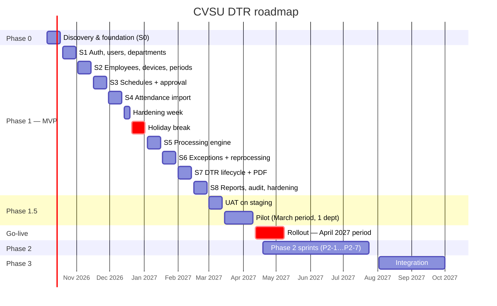

# CVSU DTR — Development Phases

Related: [[CVSU-DTR/v3/REQUIREMENTS|REQUIREMENTS]] (what) · [[CVSU-DTR/v3/MODULES|MODULES]] (where) · [[CVSU-DTR/v3/BUSINESS-RULES|BUSINESS-RULES]] · [[CVSU-DTR/v3/HR-PROCESS-FLOW.canvas|HR-PROCESS-FLOW]]

> This document owns **when and in what order** things get built. Scope ("what") lives in REQUIREMENTS §4; module design lives in MODULES.

> [!important] Update — Phase 1 re-scoped to a 1-month MVP
> Phase 1 is now **export → import → generate DTR → download**, built in 4 weeks (Oct 5 – Oct 30, 2026). See [[CVSU-DTR/v3/PHASE1-MVP-1-MONTH|PHASE1-MVP-1-MONTH]] and [[CVSU-DTR/v3/PHASE1-E2E-FLOW.canvas|PHASE1-E2E-FLOW]].
> The rest of the original Phase 1 below (employee portal, approvals, exceptions workflow, full DTR cycle, reports) becomes **Phase 1B**. Its sprint dates will be re-planned after the Oct 30 delivery.

---

## 1. Assumptions

| Item     | Assumption (adjust if different)                                                                                                                                 |
| -------- | ---------------------------------------------------------------------------------------------------------------------------------------------------------------- |
| Team     | 4 developers: **Lead / backend**, **backend**, **frontend**, **frontend + QA/docs**. Plus 1 **HR focal person** (product owner) and an **adviser/ICT reviewer**. |
| Cadence  | 2-week sprints (Mon–Fri). Sprint review/demo with HR on the last Friday.                                                                                         |
| Start    | Monday **Oct 5, 2026**                                                                                                                                           |
| Breaks   | No sprints Dec 21, 2026 – Jan 1, 2027 (holiday break). Hardening week Dec 14–18.                                                                                 |
| Tools    | Yarn 4 workspaces monorepo, GitHub (or GitLab), Docker, staging server available by Sprint 4                                                                     |
| Capacity | ~70% of time goes to planned work; the rest covers meetings, reviews, bugs and classes                                                                           |

With 2–3 developers, add about 50% to each sprint, or move Phase 1 "Should" items to Phase 2 (see §9).

---

## 2. Roadmap at a glance

| Phase                             | Dates                          | Goal                                                                       | Exit milestone                                               |
| --------------------------------- | ------------------------------ | -------------------------------------------------------------------------- | ------------------------------------------------------------ |
| **0 — Discovery & foundation**    | Oct 5 – Oct 16, 2026           | Collect the real inputs, answer HR questions, set up the repo and CI       | **M0** Inputs received, rule set v1 drafted, repo & CI green |
| **1 — MVP build** (Sprints 1–8)   | Oct 19, 2026 – Feb 26, 2027    | Full HR cycle working end-to-end                                           | **M1–M4** (see §4)                                           |
| **1.5 — UAT & pilot**             | Mar 1 – Apr 9, 2027            | Test with HR, then a one-department parallel run for the March 2027 period | **M5** Pilot results match the manual process                |
| **Go-live**                       | Apr 12, 2027 →                 | All departments, starting with the April 2027 period                       | **M6** First full month processed in the system              |
| **2 — Self-service & efficiency** | Apr 19 – Jul 23, 2027          | Correction requests, notifications, report exports, multi-campus           | **M7** Phase 2 released                                      |
| **3 — Integration**               | Aug 2027 → (new academic year) | Direct device sync, SSO, HR/payroll integration                            | **M8** Device sync live on one device                        |

---

## 3. Phase 0 — Discovery & foundation (Sprint 0: Oct 5–16, 2026)

**Goal:** remove the blockers before any feature code (REQUIREMENTS §5).

| Workstream               | Tasks                                                                                                                                                                                  | Output                                                       |
| ------------------------ | -------------------------------------------------------------------------------------------------------------------------------------------------------------------------------------- | ------------------------------------------------------------ |
| Discovery (Lead + HR)    | Get **3 real MB20 exports** (B1), the **official DTR template** and a filled sample (B2), HR attendance policy (B3); hold a workshop on the **20 open questions** (BUSINESS-RULES §11) | Signed answers → rule set v1 draft; anonymized fixture files |
| Process                  | Walk through the [[CVSU-DTR/v3/HR-PROCESS-FLOW.canvas\|HR process flow]] with HR and mark differences                                                                                  | Updated canvas + BUSINESS-RULES                              |
| Repo & tooling (Backend) | Yarn 4 monorepo (`apps/api`, `apps/web`, `packages/shared`, `packages/api-client`), ESLint/Prettier, Husky, commitlint, `.nvmrc` (Node 24), `.env.example`                             | Repo scaffold                                                |
| CI (Backend)             | GitHub Actions: `yarn install --immutable` → lint → typecheck → test → build                                                                                                           | Green pipeline on `main`                                     |
| Local env (Frontend)     | `docker compose` for Postgres; API + web run on the host; seed script                                                                                                                  | "Clone → run in 10 minutes" README                           |
| Design (Frontend + QA)   | Low-fi wireframes for the employee home, My DTR, import wizard and HR "Needs Attention"; design tokens                                                                                 | Wireframes reviewed by HR                                    |
| Planning (all)           | Backlog from user stories US-01…US-12, estimates, Definition of Ready/Done (§7)                                                                                                        | Groomed backlog for S1–S3                                    |

**Exit (M0):** B1–B3 received · 15 of the 20 HR questions answered · CI green · wireframes approved.
**If B1 or B2 is late:** continue with S1–S3 (they don't depend on them), but S4 (import) and S7 (PDF) are **at risk**. Escalate at the S1 review.

---

## 4. Phase 1 — MVP build (Sprints 1–8)

Each sprint lists **Backend (BE)**, **Frontend (FE)**, **Database (DB)** and **QA** work, the user stories it closes, and the demo HR must accept.

### Sprint 1 — Foundation: auth, users, departments (Oct 19 – Oct 30)
- **DB:** migrations `0001_init_users_auth`, `0002_org_and_devices` (departments only); roles `app_user` / `migrator`.
- **BE:** config validation, Pino logging, request ID, error filter, response envelope, `/health`; auth (login, refresh rotation, logout, invite/reset), argon2id, throttling; users, roles and department scopes; departments CRUD; audit module skeleton.
- **FE:** app shell (header, role-based sidebar, period selector placeholder), login / accept-invite / reset pages, API client generation, token-in-memory refresh flow, admin Users and Departments pages.
- **QA:** auth E2E (login, lockout, refresh reuse → revoked), scope 404 tests.
- **Stories:** US-12 (partial).
- **Demo:** SYSTEM_ADMIN invites an HR user, who logs in and sees only the HR menu.

### Sprint 2 — Master data: employees, devices, academic calendar (Nov 2 – Nov 13)
- **DB:** employees, biometric_devices, employee_biometric_ids (exclusion constraint), academic_years, semesters, dtr_periods, calendar_events.
- **BE:** employees CRUD + **bulk CSV import** (job), biometric ID mapping with validity dates, devices, periods (open/close), calendar events.
- **FE:** Employees list/detail (biometric IDs tab), bulk import wizard, Periods page, Calendar page (month view + list).
- **QA:** overlap-constraint tests; bulk import with bad rows.
- **Demo:** HR loads the real employee list (B5), sets up AY 2026-2027, semesters, monthly periods and the 2027 holidays.

### Sprint 3 — Schedules with approval (Nov 16 – Nov 27)
- **DB:** schedule_templates, employee_schedules (approved-overlap exclusion), schedule_blocks.
- **BE:** schedule CRUD, `ScheduleValidator` (overlaps, start < end, inside the semester), submit/approve/reject state machine, superseding, templates.
- **FE:** employee "My schedule" weekly editor with template picker; Department Head approval queue; HR schedules list.
- **QA:** state-machine unit tests; the head only sees their own departments.
- **Stories:** US-03, US-04.
- **Demo:** an employee submits a split schedule, the head rejects it with a reason, the employee fixes it, and the head approves.
- **Milestone M1 — "Master data ready"**: all setup data can be maintained in the system.

### Sprint 4 — Attendance import (Nov 30 – Dec 11)
- **DB:** stored_files, attendance_import_batches, staging, errors, **raw_attendance_records** (unique key + append-only trigger + grants), `v_unmatched_identifiers`.
- **BE:** Files module (local storage), `ParserRegistry` + `Mb20XlsxParser` / `Mb20CsvParser` (from B1 fixtures, streaming ExcelJS / csv-parse), row specifications, validate → commit → discard, `AttendanceService.ingest()` with `ON CONFLICT DO NOTHING`, pg-boss introduced, `/jobs/:id`.
- **FE:** import wizard (device → upload → summary → errors → commit), imports list, unmatched-IDs mapping page.
- **QA:** fixtures (real anonymized files, malformed, huge, zip bomb); re-upload and overlap produce **0 duplicates**; the append-only trigger rejects UPDATE.
- **DevOps:** **staging server up** (Docker Compose, Nginx, TLS), auto-deploy from `main`.
- **Stories:** US-01, US-02.
- **Demo:** HR uploads two overlapping real exports; the second shows "already imported" and adds only the new punches.

### Hardening week (Dec 14 – 18)
Bug fixing, refactoring, test coverage, documentation updates, the staging backup job, and a **restore test #1**. No new features.

### Sprint 5 — Processing engine (Jan 4 – Jan 15, 2027)
- **DB:** attendance_rule_sets (publish immutability), processing_jobs, processed_attendance.
- **BE:** pure domain: `PunchNormalizer`, `SlotAssigner`, `CalendarApplier`, `FixedScheduleStrategy`, `StatusResolver`, `DayCalculator` with calculation trace; `RuleSetResolver`; `ProcessPeriod` use case (advisory lock, chunks, skips locked dates); rule-set simulator endpoint.
- **FE:** Processing page (run + job progress + history), HR attendance review table + detail drawer (expected vs actual, punches used/ignored, "Why?" trace), employee "My attendance".
- **QA:** **every row of BUSINESS-RULES §10 is a passing test**; ≥ 90% branch coverage on the domain; processing a real month (≈1,000 employees) takes < 5 min on staging.
- **Stories:** US-05.
- **Demo:** process a real month; HR spot-checks 10 employees against their manual computation.
- **Milestone M2 — "Engine correct"**: HR signs off the test table and rule set v1 is **published**.

### Sprint 6 — Exceptions and reprocessing (Jan 18 – Jan 29)
- **DB:** attendance_exceptions (maker-checker CHECK), stale-marking.
- **BE:** exception CRUD + approve/reject/cancel/revoke, `ExceptionApplier` (leave, OB, time correction, missing-punch certification, schedule override), stale marking on exception/calendar/mapping/schedule changes, "process only stale", `/dtr-periods/:id/attention`.
- **FE:** Exceptions pages (type-adaptive form, approval list with maker-checker hint), HR **"Needs Attention" dashboard**, drawer action "Add exception".
- **QA:** approver = requester is rejected (API **and** DB); T11, T14 and T15 pass; revoking after finalization is blocked (stub).
- **Stories:** US-11.
- **Demo:** a missing-punch day is fixed by a certification, approved by a second HR admin, and turns PRESENT after reprocessing.

### Sprint 7 — DTR lifecycle and PDF (Feb 1 – Feb 12)
- **DB:** dtrs, dtr_items (lock trigger), dtr_status_history, dtr_documents.
- **BE:** generate/regenerate (bulk job), the DTR state machine (all transitions and guards), bulk actions, finalize transaction + snapshot, `ChromiumHtmlPdfGenerator` + **CSC Form 48 template** (from B2), SHA-256 + verification code, download with audit, `/dtrs/verify/:code`.
- **FE:** employee "My DTR" (Form 48 preview, confirm, report a problem, next-step banner, download checklist), HR DTR queue (status tabs, bulk actions, result dialog), DTR detail (timeline, documents).
- **QA:** state-machine table tests; the finalizer ≠ validator rule; the PDF is **printed on the actual HR printer** and compared with the official form; reopen creates version 2.
- **Stories:** US-06, US-07, US-08, US-09, US-10.
- **Demo:** the full cycle for one department: generate → confirm → validate → finalize → download PDF → receive.
- **Milestone M3 — "End-to-end cycle works"**.

### Sprint 8 — Reports, audit, hardening, production readiness (Feb 15 – Feb 26)
- **BE:** report endpoints (attendance summary, tardiness, submissions, imports, employees without schedule), audit-log query + sensitive-read logging, privacy-notice acceptance, retention/maintenance jobs, `/health/ready`.
- **FE:** Reports pages, Audit log page, privacy notice at first login, empty/error/loading states on every page, accessibility pass, mobile check at 360 px.
- **DevOps:** production server, backups (encrypted, off-server), **restore test #2**, monitoring and alerts, runbooks.
- **QA:** full regression, security checklist (SECURITY-PRIVACY §4), a load test (50k-row import, 1,000-employee month), a Playwright E2E suite.
- **Milestone M4 — "MVP feature-complete, release candidate"** deployed to staging.

---

## 5. Phase 1.5 — UAT and pilot (Mar 1 – Apr 9, 2027)

| Step             | Dates          | Activity                                                                                                                            | Pass criteria                                                                                                |
| ---------------- | -------------- | ----------------------------------------------------------------------------------------------------------------------------------- | ------------------------------------------------------------------------------------------------------------ |
| UAT              | Mar 1 – Mar 12 | HR runs scripted scenarios on staging with anonymized February data: import, map, process, exceptions, DTR cycle, reports           | All UAT scripts passed; no open **Critical/High** bugs                                                       |
| Go/No-go #1      | Mar 12         | Adviser + HR decide whether to start the pilot                                                                                      | Signed UAT sheet                                                                                             |
| Pilot setup      | Mar 15 – 19    | Production deploy; accounts for **one department** (~30–60 employees); schedules approved                                           | Everyone can log in; schedules approved                                                                      |
| Pilot run        | Mar 15 – Apr 9 | The **March 2027** period runs in the system **in parallel** with the manual process. Holy Week (Mar 25–26) is a good holiday test. | ≥ 99% of employee-days match the manual result; every difference is explained (a rule gap or a manual error) |
| Retrospective    | Apr 9          | Fix list, rule-set adjustments (new version), training material updates                                                             | Go-live checklist (SECURITY-PRIVACY §9) complete                                                             |
| **Milestone M5** | Apr 9          | Go/No-go #2 for rollout                                                                                                             | Signed by the HR head                                                                                        |

**Training:** a 1-hour session for HR staff, a 15-minute video plus a one-page guide for employees, and a 20-minute session for department heads (schedule approval, In-Charge signing).

---

## 6. Go-live and Phase 2 / Phase 3

### Go-live (from Apr 12, 2027)
- Roll out in **waves**: HR + pilot department → half of the departments → all (within the April period).
- Keep the manual process as a fallback for the April period only.
- Hypercare for 4 weeks: a daily bug triage, a named support contact, and hotfix releases as needed.
- **Milestone M6**: the April 2027 period is fully processed, with DTRs finalized and received in the system.

### Phase 2 — Self-service and efficiency (Apr 19 – Jul 23, 2027, ~7 sprints part-time alongside hypercare)
| Order | Feature | Notes |
|---|---|---|
| P2-1 | Employee **correction requests** with attachments | Turns "Report a problem" into exception requests |
| P2-2 | **Email notifications** (DTR ready, returned, import done) | pg-boss queue + SMTP; failures don't block the flow |
| P2-3 | **Report exports** (Excel/PDF) + habitual-tardiness report | Formula-injection escaping |
| P2-4 | **Multi-campus** scoping + multiple devices per campus | `campus` on departments, HR scope per campus |
| P2-5 | FLEXI rule strategy (if HR adopts flexi-time) | New rule set version |
| P2-6 | Usability improvements from the pilot backlog | — |
| P2-7 | Performance, dark-mode tokens (optional) | — |
**Milestone M7**: Phase 2 released before the start of AY 2027-2028.

### Phase 3 — Integration (from Aug 2027)
- **Device sync:** confirm what the MB20 model supports (ADMS push / SDK) → build the `DeviceSyncSource` adapter → run it on one device in parallel with file import → switch over. **M8**.
- **SSO** (OIDC / Google Workspace) if the university provides it.
- **HR/payroll/leave integration:** export tardiness and undertime totals in the format payroll needs.

---

## 7. Working agreements

### Definition of Ready (story can enter a sprint)
- [ ] Linked to a user story / requirement with acceptance criteria
- [ ] Business rule references exist (BUSINESS-RULES section) or are not needed
- [ ] API endpoint listed in API-DESIGN (or added in the same PR)
- [ ] UI wireframe agreed (for UI stories)
- [ ] Estimated; dependencies known

### Definition of Done (story is complete)
- [ ] Code reviewed by one other developer; CI green (`lint`, `typecheck`, tests, build)
- [ ] Unit tests for domain logic; API test for the endpoint; E2E for critical flows
- [ ] Permissions tested (allowed role ✓, other role 403/404)
- [ ] Migration reviewed as SQL; reversible or with a documented roll-forward
- [ ] Audit events recorded for state changes
- [ ] UI "definition of done" checklist met (UI_DESIGN §13)
- [ ] Docs updated if a decision changed (README ADR table)
- [ ] Deployed to staging and demoed

### Git and release flow
- Branches: `main` (always deployable to staging) + short-lived `feat/*`, `fix/*`, `chore/*`; PRs are squash-merged.
- Commits: Conventional Commits (`feat: add attendance import commit endpoint`).
- Releases: tag `vX.Y.Z` at each sprint end, with a changelog generated from commits; production deploys only from tags after M5.
- Every PR runs `yarn install --immutable`; a PR that adds `package-lock.json` or `pnpm-lock.yaml` fails.

### Ceremonies (2-week sprint)
| When | Meeting | Length |
|---|---|---|
| Day 1 | Sprint planning | 1.5 h |
| Daily (or 3×/week for a student team) | Stand-up | 15 min |
| Day 9 | Backlog refinement with HR | 45 min |
| Day 10 | Sprint review / demo with HR + retrospective | 1 h + 30 min |

---

## 8. Roles and responsibilities (RACI)

| Activity | Lead/BE | BE | FE | FE+QA | HR focal | Adviser/ICT |
|---|---|---|---|---|---|---|
| Rule decisions (BUSINESS-RULES) | C | C | I | C | **A/R** | C |
| Architecture / DB design | **A/R** | R | C | I | I | C |
| Backend modules | A | **R** | I | C | I | I |
| Frontend screens | C | I | **A/R** | R | C | I |
| Test table & UAT scripts | C | C | C | **R** | **A** | I |
| CSC Form 48 template fidelity | C | R | R | R | **A** | I |
| Infrastructure, backups | **A/R** | R | I | I | I | C |
| Go/No-go decisions | R | I | I | I | **A** | C |
| Privacy (PIA, notice) | R | I | I | R | C | **A** (with DPO) |

R = Responsible · A = Accountable · C = Consulted · I = Informed

---

## 9. MVP priorities (MoSCoW) — what to cut if time runs short

| Must (M4 needs these) | Should (cut to Phase 2 if needed) | Could |
|---|---|---|
| Auth + roles + scopes | Employee bulk import (enter manually instead) | Rule-set simulator UI |
| Employees + biometric mapping | Schedule templates | Dark-mode tokens |
| Periods + calendar | Department Head approval (HR approves instead) | Verification-code lookup page |
| Schedules (approval by HR at minimum) | Reports beyond "submission status" | Bulk receive |
| Import validate/commit + dedup | "Report a problem" note | Job history page |
| Processing (FIXED strategy) + test table | Privacy-notice acceptance tracking | — |
| Exceptions (leave, OB, correction) with maker-checker | Audit-log UI (logs still written) | — |
| DTR lifecycle + CSC Form 48 PDF | — | — |
| Submission tracking (receive) | — | — |
| Backups + restore test | — | — |

---

## 10. Risk register

| # | Risk | Likelihood | Impact | Mitigation | Owner |
|---|---|---|---|---|---|
| R1 | Real MB20 exports or the DTR template arrive late | Medium | High (S4, S7) | Ask in Phase 0; build parsers behind `ParserRegistry`; start with the CSV variant | Lead |
| R2 | HR rules unclear or changing | High | High | Versioned rule sets; signed test table at M2; open-question log | HR focal |
| R3 | Export format differs between devices/firmware | Medium | Medium | Parser per variant; fixture per device | BE |
| R4 | PDF doesn't match the official form when printed | Medium | High | Print test in S7 on the actual printer; HR approval | FE |
| R5 | Employees don't submit schedules on time | High | Medium | HR can enter schedules directly; templates; the "no schedule" list | HR focal |
| R6 | Staging/production server not available | Medium | High | Request in Phase 0; a VPS fallback budget | Adviser/ICT |
| R7 | Team availability (exams, other classes) | High | Medium | 70% capacity planning; MoSCoW cuts (§9) | Lead |
| R8 | Data privacy concerns block the pilot | Low | High | Start the PIA in S6; anonymized staging data | Lead + DPO |
| R9 | Performance with large imports | Low | Medium | Streaming parse, batch insert, load test in S8 | BE |
| R10 | Scope creep (payroll, leave credits) | Medium | Medium | Out of scope per REQUIREMENTS §4; route requests to the Phase 2/3 backlog | HR focal |

---

## 11. Milestones and sign-offs

| ID | Milestone | Target date | Evidence | Signed by |
|---|---|---|---|---|
| M0 | Inputs received, repo & CI ready | Oct 16, 2026 | Fixture files, answered questions, green CI | HR focal, Lead |
| M1 | Master data ready | Nov 27, 2026 | S3 demo | HR focal |
| M2 | Engine correct | Jan 15, 2027 | §10 test table all green + HR spot-check | HR head |
| M3 | End-to-end cycle works | Feb 12, 2027 | S7 demo + printed PDF | HR focal |
| M4 | Release candidate | Feb 26, 2027 | Regression + security checklist + restore test | Lead, Adviser |
| M5 | Pilot passed | Apr 9, 2027 | ≥ 99% match report | HR head |
| M6 | Full go-live month done | May 2027 | April period received in the system | HR head |
| M7 | Phase 2 released | Jul 23, 2027 | Release notes | HR focal |
| M8 | Device sync live (1 device) | AY 2027-2028 | Parallel-run report | HR head, ICT |

## 12. Progress metrics
- **Sprint:** planned vs completed story points, escaped bugs, CI pass rate.
- **Quality:** domain branch coverage ≥ 90%, open Critical/High bugs = 0 at milestones.
- **Business (after go-live):** days from last export to all DTRs finalized; % of DTRs returned; % received by the deadline; number of manual corrections per period.
