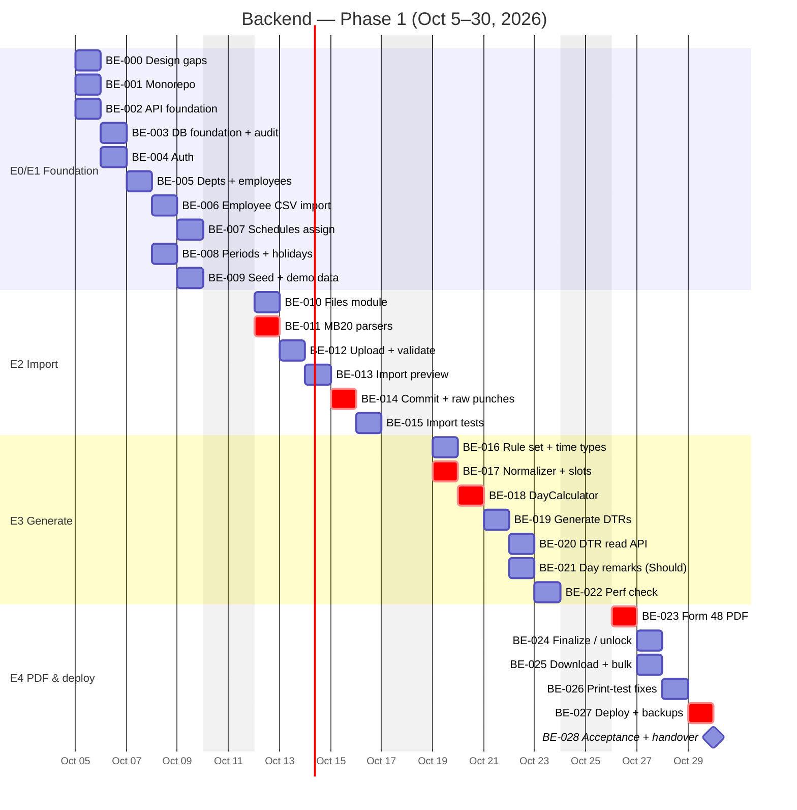
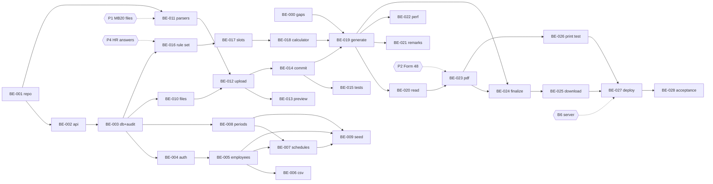

# CVSU DTR — Backend Roadmap (Phase 1)

Plan: [[CVSU-DTR/v3/PHASE1-MVP-1-MONTH|PHASE1-MVP-1-MONTH]] · Flow: [[CVSU-DTR/v3/PHASE1-E2E-FLOW.canvas|PHASE1-E2E-FLOW]] · Board: [[CVSU-DTR/v3/backend/BACKEND-BOARD.base|BACKEND-BOARD]]

> [!goal] Phase 1 backend in one sentence
> An API that lets HR **import MB20 exports without duplicates → generate correct DTRs → finalize → download CSC Form 48 PDFs**, deployed on the real server by **Thu Oct 29**, accepted by HR on **Fri Oct 30, 2026**.

> [!info] How to use this
> Each ticket is a note in `tickets/` with properties (`status`, `week`, `day`, `estimate_h`, `depends_on`, `blocked_by`). Update `status` there (`TODO → IN PROGRESS → REVIEW → DONE`, or `BLOCKED`). [[CVSU-DTR/v3/backend/BACKEND-BOARD.base|BACKEND-BOARD]] shows them by week, blocked, and done.
> Coding rules come from the project skills: `dtr-backend`, `dtr-database`, `dtr-security`, `dtr-testing`.

---

## 1. Epics and milestones

| Epic | Week | Tickets | Milestone (demo) |
|---|---|---|---|
| **E0 Design gaps** | 1 (Mon) | BE-000 | Phase 1 decisions logged in the README ADR table |
| **E1 Foundation & setup data** | 1 · Oct 5–9 | BE-001 … BE-009 | **Fri Oct 9:** real employee list loaded, schedule assigned, October created |
| **E2 Attendance import** | 2 · Oct 12–16 | BE-010 … BE-015 | **Fri Oct 16:** 2 overlapping real exports, 2nd adds only new punches |
| **E3 DTR generation** | 3 · Oct 19–23 | BE-016 … BE-022 | **Fri Oct 23:** 10 generated DTRs match HR's manual results |
| **E4 PDF, finalize, deploy** | 4 · Oct 26–30 | BE-023 … BE-028 | **Fri Oct 30:** HR acceptance A1–A12 on the real server |

## 2. Timeline

## 3. Ticket index

| ID | Title | Pri | Day | Est (h) | Depends on | External blocker |
|---|---|---|---|---|---|---|
| [[BE-000-resolve-phase1-design-gaps\|BE-000]] | Resolve Phase 1 design gaps (ADR) | P0 | Mon 5 | 2 | — | — |
| [[BE-001-monorepo-scaffold\|BE-001]] | Monorepo scaffold + CI | P0 | Mon 5 | 3 | — | — |
| [[BE-002-api-foundation\|BE-002]] | API foundation (config, errors, logging, health, Clock) | P0 | Mon 5 | 3 | 001 | — |
| [[BE-003-db-foundation-and-audit\|BE-003]] | DB foundation, roles, migrations 0001–0002, audit | P0 | Tue 6 | 4 | 002 | — |
| [[BE-004-auth\|BE-004]] | Auth: login, refresh rotation, lockout, change password | P0 | Tue 6 | 5 | 003 | — |
| [[BE-005-departments-employees-biometric-ids\|BE-005]] | Departments, employees, biometric ID mapping | P1 | Wed 7 | 4 | 004 | — |
| [[BE-006-employee-csv-import\|BE-006]] | Employee CSV import | P2 | Thu 8 | 3 | 005 | P3 employee list |
| [[BE-007-schedule-templates-and-assign\|BE-007]] | Schedule templates + assign (pre-approved) | P1 | Fri 9 | 3 | 005, 008 | — |
| [[BE-008-dtr-periods-and-holidays\|BE-008]] | DTR periods + holidays (calendar) | P1 | Thu 8 | 3 | 003 | — |
| [[BE-009-seed-and-demo-data\|BE-009]] | Seed script + week-1 demo | P1 | Fri 9 | 1 | 005–008 | — |
| [[BE-010-files-module\|BE-010]] | Files module (stored_files, local storage) | P1 | Mon 12 | 2 | 003 | — |
| [[BE-011-mb20-parsers\|BE-011]] | MB20 XLSX/CSV parsers + ParserRegistry | P0 | Mon 12 | 5 | 001 | **P1 real exports** |
| [[BE-012-import-upload-and-validate\|BE-012]] | Import upload + validate (staging, errors, guards) | P0 | Tue 13 | 5 | 010, 011 | — |
| [[BE-013-import-preview-and-unmatched\|BE-013]] | Import preview + unmatched IDs | P1 | Wed 14 | 3 | 012 | — |
| [[BE-014-import-commit-and-raw-punches\|BE-014]] | Commit/discard + append-only raw punches | P0 | Thu 15 | 4 | 012 | — |
| [[BE-015-import-integration-tests\|BE-015]] | Import integration tests (dedup, overlap, bad files) | P0 | Fri 16 | 3 | 013, 014 | — |
| [[BE-016-rule-set-and-time-types\|BE-016]] | Rule set + LocalDate/LocalTime + migration 0006 | P0 | Mon 19 | 2 | 003 | P4 HR answers |
| [[BE-017-punch-normalizer-and-slot-assigner\|BE-017]] | PunchNormalizer + SlotAssigner (T01–T07) | P0 | Mon 19 | 4 | 016 | — |
| [[BE-018-day-calculator\|BE-018]] | DayCalculator: FIXED strategy, status, flags, trace | P0 | Tue 20 | 6 | 017 | — |
| [[BE-019-generate-dtrs\|BE-019]] | Generate DTRs (processed_attendance, dtrs, dtr_items) | P0 | Wed 21 | 5 | 000, 014, 018 | — |
| [[BE-020-dtr-read-api\|BE-020]] | DTR list + detail API | P1 | Thu 22 | 2 | 019 | — |
| [[BE-021-day-remarks\|BE-021]] | Day remarks → approved exceptions (Should) | P2 | Thu 22 | 3 | 019 | — |
| [[BE-022-performance-check\|BE-022]] | Performance check (1,000 employees × 1 month) | P1 | Fri 23 | 2 | 019 | — |
| [[BE-023-csc48-pdf-generator\|BE-023]] | CSC Form 48 template + Puppeteer PDF + SHA-256 | P0 | Mon 26 | 6 | 020 | **P2 DTR template** |
| [[BE-024-finalize-and-unlock\|BE-024]] | Finalize / unlock + history + freeze trigger | P0 | Tue 27 | 3 | 019, 023 | — |
| [[BE-025-pdf-download-and-bulk\|BE-025]] | PDF download + bulk ZIP / merged | P1 | Tue 27 | 3 | 023, 024 | — |
| [[BE-026-print-test-fixes\|BE-026]] | Print test on HR printer + layout fixes | P0 | Wed 28 | 2 | 023 | HR printer access |
| [[BE-027-deploy-and-backups\|BE-027]] | Deploy (Compose, Nginx, TLS) + backup + restore test | P0 | Thu 29 | 5 | all | **B6 server** |
| [[BE-028-acceptance-and-handover\|BE-028]] | HR acceptance A1–A12 + runbooks + handover | P0 | Fri 30 | 3 | 027 | HR availability |

**Priority key:** P0 = never cut (dedup, append-only, calculation tests, backups, the core flow) · P1 = must for Phase 1 · P2 = *Should*, first to cut.

## 4. Dependency graph

## 5. Capacity check ⚠

| Week | Backend estimate | Realistic backend capacity (1 dev also doing frontend, ~4–5 h/day) | Verdict |
|---|---|---|---|
| 1 | 31 h | 20–25 h | 🔴 **Over**: move BE-006 (CSV import) to week 2 slack, or get a 2nd dev |
| 2 | 22 h | 20–25 h | 🟡 Tight, and BE-011 depends on P1 |
| 3 | 24 h | 20–25 h | 🟡 Tight, BE-021 is the buffer |
| 4 | 22 h | 20–25 h | 🟡 Tight, and BE-023/027 depend on P2/B6 |
| **Total** | **99 h** | **80–100 h** | 🟡 Possible only if nothing slips. Use the cut list. |

**Cut list (in this order, from PHASE1-MVP §11):** ① BE-021 day remarks → ② merged PDF in BE-025 (keep ZIP) → ③ BE-006 employee CSV (enter manually / SQL seed) → ④ unlock in BE-024 (DB fix by admin) → ⑤ dashboard warning endpoints.
**Never cut:** BE-014 dedup + append-only, BE-017/018 tests, BE-027 backups.

## 6. External blockers (chase today)

| # | Needed by | Blocks | If late |
|---|---|---|---|
| P3 Employee list + biometric IDs | Thu Oct 8 | BE-006, BE-009 demo | Use synthetic data; load real list in week 2 |
| **P1 2–3 real MB20 exports** | **Fri Oct 9** | BE-011 → all of E2 | Build the CSV parser against a guessed layout; adapt on arrival |
| P4 HR answers Q1–Q5 | Fri Oct 16 | BE-016 rule values | Use BUSINESS-RULES defaults (grace 0, lunch punches optional) |
| HR manual results for 10 employees | Wed Oct 21 | BE-022 demo, A8 | Demo without comparison; A8 at risk |
| **P2 Form 48 template + filled sample** | **Fri Oct 23** | BE-023 | Use standard CSC Form 48 layout; adjust after HR review |
| **B6 server, domain, TLS** | **Fri Oct 23** | BE-027 | Laptop demo with Docker Compose; deploy the next week |

## 7. After Phase 1 (Phase 1B backend, outline only)

To be ticketed after Oct 30: roles HR_STAFF / DEPARTMENT_HEAD / EMPLOYEE + department scopes → `/me/*` endpoints → schedule submit/approve workflow → exceptions with maker-checker → full DTR state machine (review → validate → finalize → submit → receive) → pg-boss jobs → reports → audit-log API + sensitive-read logging → privacy notice. See [[CVSU-DTR/v3/DEVELOPMENT-PHASES|DEVELOPMENT-PHASES]].
